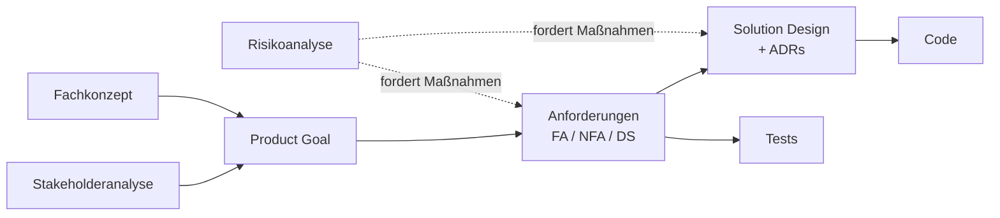

# Anforderungs- und Lösungsmanagement

| | |
|---|---|
| **Projekt** | PRE/SYP-PRP-Bewertung |
| **Dokument** | Konzept für Anforderungs- und Lösungsmanagement |
| **Version** | 0.1 |
| **Datum** | 2026-09-09 |
| **Autor** | Gerald Hainbucher |
| **Status** | Entwurf – nicht freigegeben |
| **Gültig für Softwarestand** | 0.3.0 |
| **Zuletzt geprüft** | 2026-09-11 |
| **Nächste Prüfung** | Ende Sprint 1 |

---

## 1 Änderungshistorie

| Version | Datum | Autor | Änderung | Status |
|---|---|---|---|---|
| 0.1 | 2026-09-09 | G. Hainbucher | Ersterstellung: Dokumentenlandschaft, Anforderungsformat, Ablage, Nachvollziehbarkeit, Aktualität | Entwurf |

---

## 2 Zweck

Dieses Dokument legt fest, **wie im Projekt PRE/SYP-PRP-Bewertung Anforderungen und Lösungen geführt
werden**: in welcher Form sie formuliert sind, wo sie liegen, wie sie zusammenhängen und
wodurch sie aktuell bleiben.

Es folgt einem einfachen Anspruch: *Zufriedene Stakeholder bei geringstmöglichem Aufwand und
beherrschbarem Risiko.* Damit dieser Satz mehr ist als ein Plakat, muss jede der drei Größen
an einem Artefakt hängen, das gepflegt wird — und dessen Verfall auffällt.

Dieses Dokument gilt für das Repository dieser Anwendung. Für die Projekte der Schülerteams
gilt Kapitel 10.

---

## 3 Dokumentenlandschaft

Jedes Thema hat genau **ein** führendes Dokument. Überall sonst wird verlinkt, nicht kopiert.

| Artefakt | Datei | Führt | Rahmenbedingung |
|---|---|---|---|
| Fachkonzept Unterricht | `docs/fachkonzept-unterricht.md` | Didaktik, Kompetenzmodell, Beurteilung | — |
| Stakeholderanalyse | `docs/stakeholder.md` | Wer, welches Interesse, welches Erfolgskriterium | RB-07 |
| Product Goal | `docs/product-goal.md` | Wozu es das Produkt gibt | RB-09 |
| Anforderungen | `docs/anforderungen.md` | Was das Produkt können muss | RB-01 |
| Solution Design | `docs/solution-design.md` | Wie es umgesetzt ist | RB-02 |
| Risikoanalyse | `docs/risiken.md` | Was schiefgehen kann und was dagegen getan wird | RB-08 |
| Architekturentscheidungen | `docs/adr/` | Warum eine Lösung so und nicht anders ist | RB-02 |
| Änderungsprotokoll | `docs/CHANGELOG.md` | Was sich je Version geändert hat | RB-03 |
| Arbeitspakete | GitHub Issues | Was gerade zu tun ist | — |

Jedes dieser Dokumente trägt den **Aktualitätskopf** wie oben: Version, gültig für
Softwarestand, zuletzt geprüft, nächste Prüfung. Vier Zeilen, die Veralterung sichtbar machen.

### 3.1 Ableitungskette



Jedes Glied ist rückwärts lesbar: Zu jeder Anforderung gehört ein Zweck, zu jedem Zweck ein
Stakeholder, zu jedem Risiko eine Maßnahme. **Eine gerissene Kette ist ein Fehler, kein
Schönheitsfehler** — sie bedeutet, dass etwas gebaut wird, wofür niemand einen Grund benennen
kann, oder dass ein Risiko unversorgt ist.

---

## 4 Anforderungsformat

### 4.1 Satzschablone

Funktionale Anforderungen werden als **User Story mit Satzschablone** formuliert:

> Als **‹Rolle›**
> möchte ich **‹Ziel›**,
> damit **‹Nutzen›**.

Die Schablone ist verpflichtend, auch wenn es nur wenige Rollen gibt. Sie ist kein
Formalismus, sondern ein Denkgerüst: Sie erzwingt, eine Rolle und einen Nutzen zu benennen —
genau die beiden Teile, die erfahrungsgemäß weggelassen werden. „Die Software soll einen
Speichern-Knopf haben“ ist keine Anforderung, sondern eine Lösungsidee; die Schablone macht
sichtbar, dass zwei Drittel fehlen.

Der Nutzenteil ist zugleich die Verbindung zum Product Goal und zum Stakeholder. **Eine Story
ohne Nutzen ist nicht priorisierbar.**

### 4.2 Die drei Prüffragen

Die Schablone kann rituell gefüllt werden. Vor der Aufnahme einer Anforderung sind deshalb
drei Fragen zu beantworten:

1. **Steht in der Rolle etwas Konkretes?** „Als Benutzer“ heißt: Die Rolle wurde nicht
   durchdacht.
2. **Steht im „damit“ ein Nutzen — oder nur die Funktion nochmal?** Lässt sich der Nutzenteil
   streichen, ohne dass Information verloren geht, fehlt die Begründung.
3. **Kann zu jedem Akzeptanzkriterium gesagt werden, wie es geprüft wird?** Wenn nein, ist es
   eine Meinung, kein Kriterium.

### 4.3 Ausnahme: nicht-funktionale Anforderungen

Bei NFAs bricht die Schablone. „Als Lehrkraft möchte ich, dass Farbkontraste WCAG AA
erfüllen, damit …“ ist gequält und sagt weniger als der Aussagesatz. **NFAs werden als
Aussagesatz mit messbarem Kriterium und benanntem Prüfverfahren formuliert.** Zu wissen, wann
ein Werkzeug nicht passt, gehört zum Werkzeug.

Dasselbe gilt für Datenschutzanforderungen (DS-xx) und Rahmenbedingungen (RB-xx).

### 4.4 Aufbau einer Anforderung

```markdown
### FA-32 Bewertungsbegründung je Person

`Soll` · 0.2.0 · SH-2, SH-3, SH-4 · geplant

Als Schülerin oder Schüler
möchte ich zu meiner Note eine schriftliche Herleitung erhalten,
damit ich weiß, woran ich im nächsten Sprint arbeiten muss.

- **AK-1** Gegeben eine Person mit mindestens einem bewerteten Sprint, wenn die Begründung
  erzeugt wird, dann enthält sie je Kategorie die Kriterien, die vergebenen Punkte und den
  Prozentwert.
- **AK-2** Nicht bewertete Kategorien erscheinen als „nicht bewertet“, nicht als 0.
- **AK-3** Die Begründung enthält keine internen Bezeichner oder IDs.

*Behandelt Risiko R-02.*
```

Die Kopfzeile ist bewusst eine Zeile und keine Tabelle: Bei über sechzig Anforderungen macht
eine fünfzeilige Tabelle je Eintrag das Dokument unlesbar. Ihr Aufbau ist fix und wird vom
Prüflauf gelesen:

```
`Priorität` · Release · Stakeholder-IDs · Status
```

Zulässige Status: `geplant`, `umgesetzt`, `offen`, `entfallen`.

Akzeptanzkriterien werden als **Gegeben / wenn / dann** formuliert, wo das Verhalten vom
Zustand abhängt, und sonst als prüfbarer Aussagesatz. Sie sind zugleich die Testnamen
(Kapitel 6).

**Nicht-funktionale und Datenschutzanforderungen** tragen dieselbe Kopfzeile, statt der
Schablone aber einen Aussagesatz und eine Zeile `**Prüfung:** …`. Nennt diese Zeile ein
Verfahren, das kein benannter Test ist – Sichtprüfung, Abdeckungsbericht, Browser-Matrix –,
befreit das von der Testpflicht des Prüflaufs. Es muss aber dastehen.

### 4.5 Nummernkreise

| Präfix | Bedeutung | Vergabe |
|---|---|---|
| `FA-nn` | funktionale Anforderung | fortlaufend, nie wiederverwendet |
| `NFA-nn` | nicht-funktionale Anforderung | fortlaufend |
| `DS-nn` | Datenschutzanforderung | fortlaufend |
| `RB-nn` | Rahmenbedingung | fortlaufend |
| `AK-n` | Akzeptanzkriterium **innerhalb** einer Anforderung | je Anforderung von 1 |
| `R-nn` | Risiko | fortlaufend |
| `ADR-nnn` | Architekturentscheidung | fortlaufend |

**IDs werden nie wiederverwendet und nie umnummeriert.** Eine entfallene Anforderung bekommt
den Status „entfallen“ und bleibt mit Begründung stehen — sonst zeigen Commits, Tests und
Protokolle irgendwann auf etwas anderes, als sie gemeint haben.

---

## 5 Ablage: Dokument und Issue

**Der Story-Text steht genau einmal — in `docs/anforderungen.md`.** Das Issue verweist
darauf und enthält keinen Story-Text.

| | Anforderung | Issue |
|---|---|---|
| Lebensdauer | dauerhaft, gilt auch nach der Umsetzung | vergänglich, wird geschlossen |
| Inhalt | Story, Akzeptanzkriterien, Priorität, Zweck | Aufgaben, Zuordnung, Fortschritt |
| Ort | Repository, versioniert | GitHub |
| Änderung | über Pull Request, als Diff reviewbar | direkt |

Ein Issue kann mehrere Anforderungen berühren; eine große Anforderung kann in mehrere Issues
zerfallen. Deshalb zwei Nummernkreise und keine 1:1-Beziehung.

**Aufbau eines Issues:**

```
Titel:      FA-32 Bewertungsbegründung je Person
Labels:     anforderung, prio:soll
Milestone:  0.2.0

Anforderung: docs/anforderungen.md#fa-32-bewertungsbegründung-je-person

Aufgaben
- [ ] AK-1
- [ ] AK-2
- [ ] AK-3
- [ ] Changelog-Eintrag
```

Nur die **Nummern** der Akzeptanzkriterien als Haken, nicht ihr Text. Sobald derselbe Text an
zwei Stellen steht, driften die Stellen auseinander, und im Zweifel weiß niemand mehr, welche
Fassung gilt.

**Warum nicht umgekehrt — Issues als Quelle, Dokument daraus erzeugt?** Drei Gründe:

1. Ein geschlossenes Issue verschwindet aus dem Blick, eine Anforderung gilt weiter. RB-01
   verlangt eine Spezifikation, kein Ticketarchiv.
2. Eine Anforderungsänderung gehört reviewt wie Code. Im Dokument ist sie ein Diff im Pull
   Request; in GitHub ist sie eine stille Bearbeitung.
3. Der Inhalt läge außerhalb des Repositories. Ein `git clone` hätte die Spezifikation nicht
   dabei, und der Prüflauf käme nur über die API daran.

**Milestones sind Releases** (`0.2.0`, `0.3.0`), nicht Labels — so zeigt GitHub den
Fortschritt gleich mit an. Ein Projects-Board nur, wenn es tatsächlich angesehen wird; sonst
ist es ein weiteres Ding, das veraltet.

---

## 6 Nachvollziehbarkeit

Die Anforderungs-ID begleitet die Umsetzung durch alle Stationen:

| Station | Form |
|---|---|
| Testname | `it('lässt nicht bewertete Sprints leer (FA-31/AK-2)', …)` |
| Commit | `feat(auswertung): Bewertungsbegründung je Person (FA-32)` |
| Pull Request | `Closes #12` |
| Changelog | Eintrag mit ID in Klammern |

Damit ist die Kette **Stakeholder → Product Goal → Anforderung → Akzeptanzkriterium → Test →
Code** maschinell prüfbar. Das ist der eigentliche Grund für die Formatstrenge: Die
Überschriftenform ist keine Kosmetik, sondern eine Schnittstelle.

---

## 7 Aktualität

Dokumente veralten leise. Das fällt erst auf, wenn man sich im Anlassfall auf sie stützen
will. Drei gestaffelte Mechanismen:

**Erstens — sichtbar machen.** Der Aktualitätskopf in jedem Dokument.

**Zweitens — fixer Prüfpunkt im Takt.** Am Ende jedes Sprints die Frage: Hat sich etwas
geändert, das eines der geführten Dokumente berührt? Das ist der billigste Ort, weil man
ohnehin dort ist. Der Punkt steht in der Definition of Done.

**Drittens — maschinell prüfen.** `npm run dokumente-pruefen`, in der Pipeline mitlaufend:

| Prüfung | Wirkung |
|---|---|
| Jede **umgesetzte** Anforderung wird von mindestens einem Test genannt – oder nennt ein anderes Prüfverfahren | **hart** |
| Jede Anforderung nennt einen Stakeholder | **hart** |
| Jede funktionale Anforderung nennt einen Nutzen („damit …“) | **hart** |
| Jede nicht-funktionale und jede Datenschutzanforderung nennt ein Prüfverfahren | **hart** |
| Jedes Risiko nennt mindestens eine Maßnahme mit Verweis | **hart** |
| Dokument steht auf älterem Softwarestand als `package.json` | weich (Warnung) |
| „Zuletzt geprüft“ älter als ein Sprint | weich (Warnung) |

Der Lauf erkennt in Testnamen auch Bereiche der Form `FA-01 bis FA-04`. Umgesetzt in
`scripts/dokumente-pruefen.mjs`, aufrufbar mit `npm run dokumente`.

Gerissene Ketten brechen den Lauf, überfällige Fristen warnen nur. Der Gedanke dahinter:
Eine gerissene Kette ist ein inhaltlicher Fehler, eine überschrittene Frist ist ein
Terminproblem — und ein Terminproblem darf nicht dazu führen, dass an einem ungünstigen Tag
gar nichts mehr zusammengeführt werden kann.

> **Offener Punkt OP-M1:** Diese Aufteilung hart/weich ist ein Vorschlag und mit dem
> Auftraggeber zu bestätigen. Sie ist bereits so umgesetzt, damit der Vorschlag erprobt
> werden kann.

---

## 8 Änderung einer Anforderung

1. Anforderung im Dokument ändern — Text, Kriterien oder Status.
2. Version des Dokuments erhöhen und Änderungshistorie ergänzen.
3. Prüfen, ob Solution Design, Risikoanalyse oder Product Goal nachzuziehen sind.
4. Als eigenen `docs/…`-Branch und Pull Request führen, damit die Änderung reviewbar ist.
5. Bei Freigabe: Git-Tag `docs/anforderungen-vX.Y`.

Eine Anforderung wird **nicht gelöscht**, sondern auf „entfallen“ gesetzt, mit Datum und
Begründung. Sonst verliert man den Grund, warum etwas einmal wichtig war.

---

## 9 Wachstumspfad

Heute liegen alle Anforderungen in einer Datei. Das trägt bei der aktuellen Größe und hält
den Aufwand klein.

**Umstieg auf eine Datei je Anforderung** (`docs/anforderungen/FA-032-….md` mit
YAML-Frontmatter, Gesamtdokument generiert) bei einem dieser Auslöser:

- mehr als etwa 60 Anforderungen, oder
- mehr als eine Person schreibt regelmäßig daran.

Vorteile dann: winzige Diffs, saubere Historie je Anforderung, strukturierte Daten für den
Prüflauf statt Textmustern. Kosten: ein Generatorskript und viele Dateien. Der Auslöser ist
benannt, damit der Umstieg eine Entscheidung bleibt und kein Abdriften.

---

## 10 Abgrenzung: Projekte der Schülerteams

Für die Schülerteams gilt dieses Dokument **nicht**. Ihr Product Backlog gehört in GitHub
Issues und ein Projects-Board — sie sollen genau das lernen, und sie haben kein RB-01, das
ein dauerhaftes Lastenheft verlangt.

Das Repository zeigt beides nebeneinander: die dauerhafte Spezifikation und
das arbeitende Backlog. Dass diese zwei Dinge verschieden sind und verschiedene Lebensdauern
haben, ist selbst eine der nützlicheren Einsichten aus einem solchen Projekt.

Die Satzschablone, die drei Prüffragen und das Format der Akzeptanzkriterien gelten für die
Schülerteams sehr wohl — sie sind das Handwerkszeug, nicht die Bürokratie.

---

## 11 Offene Punkte

| Nr. | Frage | Status |
|---|---|---|
| OP-M1 | Aufteilung hart/weich im Prüflauf bestätigen | offen |
| OP-M2 | Wird ein Projects-Board tatsächlich genutzt, oder genügen Milestones? | offen |
| OP-M3 | Sollen Aufwandsschätzungen (S/M/L) je Anforderung geführt werden? Priorität ohne Aufwand ist die halbe Entscheidungsgrundlage. | offen |
