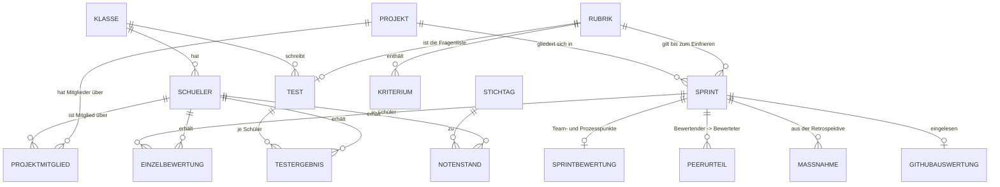

# Entwurf: Datenschema nach dem Sichtengespräch vom 14.09.2026

> **Stillgelegt am 14.09.2026. Dieses Papier gilt nicht mehr.**
>
> Sein Inhalt ist aufgeteilt worden, wie es die Ablage verlangt:
> das **fachliche** Modell in das [Fachkonzept, Kapitel 15](fachkonzept-unterricht.md),
> das **technische** in das [Solution-Design, Kapitel 5.0c](solution-design.md).
> Die Vermischung beider in diesem Papier war der Anlass für die Trennung.
>
> Erhalten bleibt es als Beleg, wie das Modell entstanden ist – nicht als Vorgabe.

**Status: Entwurf zur Prüfung. Nichts davon ist umgesetzt.**

Dieses Papier spiegelt zurück, was aus den Festlegungen des Auftraggebers vom 13. und
14.09.2026 für das Datenmodell folgt – damit Fehler im Modell auffallen, bevor Code entsteht.
Es ersetzt noch keine Anforderung und kein ADR.

---

## 1 Die Festlegungen, aus denen das Folgende entsteht

| # | Festlegung (Auftraggeber, 14.09.2026) |
|---|---|
| F1 | Es gibt **zwei getrennte Leistungsbereiche**: Projekte und Tests. Je Bereich eine Sicht zum Erfassen und eine für seine Stammdaten. |
| F2 | **Schüler werden zu Projekten zugeordnet, nicht zu Sprints.** |
| F3 | Ein Schüler **darf** in mehreren Projekten gleichzeitig sein. Praktisch kommt es kaum vor; die Anwendung **warnt** und lässt es nach **Bestätigung** zu. |
| F4 | Die Schüler werden **beim Projekt** gewählt, nicht das Projekt beim Schüler. |
| F5 | Die **Klasse hat keine Beziehung zum Projekt**, nur zum Schüler. Über den Schüler lässt sich indirekt nach Klasse filtern. |
| F6 | Ein **Sprint hängt am Projekt**, nie am Schüler. |
| F7 | Ein Projekt trägt **Name, Art, Repository, Zeitraum, Beschreibung** und seine Schüler. Der Zeitraum ist **reine Information für den Leser** – er wird nicht geprüft und geht in keine Rechnung ein. |
| F8 | Schüler & Klassen sowie Rubrik & Notenschlüssel sind **ebenfalls Stammdaten** und bleiben in der Anwendung. |
| F9 | Eine **Diplomarbeit ist generisch auch ein Projekt** – eines vom Typ Diplomarbeit. Eine eigene Sicht dafür gibt es nicht. Projekte werden **typisiert**; typspezifische Attribute kommen später (ab November) dazu. |

*Bestätigt am 14.09.2026: die Mitgliedschaft als eigene Größe, das Verschmelzen von Abschnitt
und Planung, der Wegfall der Klasse am Projekt.*

---

## 2 Das Modell

### Felder, soweit sie neu oder verändert sind

| Größe | Felder | Anmerkung |
|---|---|---|
| **SCHUELER** | `klasseId`, `name`, `githubKennung?`, `schulEmail?` | Die Klasse hängt hier und nur hier (F5). |
| **PROJEKT** | `name`, `art`, `repository?`, `von?`, `bis?`, `beschreibung?` | **Keine `klasseId` mehr** (F5). `von`/`bis` sind Text für den Leser, kein Rechenwert (F7). |
| **PROJEKTMITGLIED** | `projektId`, `schuelerId`, `ueberschneidungBestaetigtAm?` | Eigene Größe statt eines Feldes an der Person, weil ein Schüler in mehreren Projekten sein darf (F3). Die **Bestätigung der Überschneidung steht an der Mitgliedschaft** – dort, wo sie entsteht, und damit nachvollziehbar. |
| **SPRINT** | `projektId`, `nummer`, `name`, `ziel`, `von`, `bis`, `faktor`, `peerAktiv`, `rubrikId`, `rubrikKopie?`, `herkunft?`, `geplantAm?`, `eingefrorenAm?`, `angeglichenAm?`, `fixiertAm?`, `abgeschlossenAm?` | **Aus zwei Größen wird eine** – siehe 3. |
| **TEST** | `klasseId`, `nummer`, `name`, `angekuendigtAm?`, `arbeitszeitMinuten?`, `faktor`, `rubrikId` | Die Rubrik eines Tests **sind** seine Fragen. Ein Test gehört der Klasse, nicht einem Projekt. |
| **SPRINTBEWERTUNG** | `sprintId`, `team{}`, `prozess{}`, `notiz` | **Kein `teamId` mehr**: Ein Sprint gehört genau einem Projekt. |

---

## 3 Was gegenüber heute verschwindet

Alle vier Punkte sind Folgen von F2 und F6, keine eigenen Entscheidungen.

1. **`Zugehoerigkeit` (Team je Abschnitt) entfällt.** Die Zuordnung liegt am Projekt.
2. **`Teamabschnitt` verschmilzt mit dem Sprint.** Diese Größe existierte nur, weil ein
   Abschnitt einer *Klasse* gehörte und deshalb mehrere Teams betraf – Ziel, Zeitraum,
   Kriterienkopie und Abschluss mussten je Team danebenstehen. Gehört der Sprint dem Projekt,
   ist das alles Teil des Sprints. **Zwei Größen werden zu einer.**
3. **`Bewertung.teamId` entfällt.** Eine Bewertung hängt am Sprint.
4. **`Team.kennungen` entfällt.** Die GitHub-Kennung liegt seit 13.09.2026 am Schüler.
5. **Die Abschnittsart `diplomarbeit` entfällt** (F9). Auf der Projektseite heißt alles Sprint;
   die Diplomarbeit ist ein Projekt**typ**, kein Abschnittstyp. Damit verschwindet auch der
   Reiter „Diplomarbeitsvorbereitung". Die dafür ausgelieferte Rubrik geht nicht verloren – sie
   bleibt eine Rubrik, und welche ein Projekt benutzt, hängt am Projekt.

`Team` heißt durchgehend `Projekt`.

**Das ist ein Schemawechsel (Stand 4) mit Migration.** Er ist heute billig – es liegen keine
echten Daten vor. Mit Noten im Bestand wäre er das teuerste Ereignis dieses Projekts (R-01).

---

## 4 Was das Modell *nicht* ändert

Damit klar ist, wovon hier nicht die Rede ist:

- **Keine Rechenregel ändert sich.** Kategoriegewichte, Zeitfaktor nach § 20 Abs. 1 LBVO,
  Peer-Korrektur, gesetzte Werte, Notenfindung, die Sperre nach § 14 LBVO – alles unverändert.
- **Die eingefrorene Rubrik bleibt maßgeblich** (FA-65): Sobald `rubrikKopie` existiert, gilt
  sie, nie mehr die aktuelle Rubrik.
- **Ein leeres Feld bleibt „nicht bewertet"** und wird nicht zu 0 Punkten (ADR-004).
- **Der Notenschlüssel bleibt einzeln** und gilt für den ganzen Gegenstand, über beide
  Leistungsbereiche hinweg.

---

## 5 Offene Punkte

**O-1 · Die Diplomarbeitsvorbereitung.** *Entschieden am 14.09.2026 (F9): Sie ist ein Projekt
vom Typ Diplomarbeit und hat Sprints wie jedes andere Projekt. Die Abschnittsart entfällt.*

**O-4 · Wie viele Projekttypen?** Heute stehen drei Werte im Feld: `syp-pre-4`, `syp-pre-5`,
`diplomarbeit`. Die ersten beiden unterscheiden sich nur im **Jahrgang**, nicht in der Sache.
Sauberer wären zwei Typen – *SYP/PRE-Projekt* und *Diplomarbeit* – und der Jahrgang als eigenes
Attribut. Das ist auch die bessere Grundlage für die typspezifischen Attribute ab November und
für einen Jahrgangsfilter, der nicht am Typ hängt.

*Auftraggeber, 14.09.2026: **bewusst nicht aufgelöst.** Die fehlende Normalisierung ist bekannt,
es gibt derzeit keinen Anlass – die drei Werte bleiben. Steht als **OP-F36** auf der Merkliste,
falls die typspezifischen Attribute es später erzwingen.*

**O-2 · Eine Struktur oder zwei?** Fachlich sind Sprint und Test zwei Dinge mit verschiedenen
Eltern (Projekt bzw. Klasse) – so stehen sie oben. In der Rechnung verhalten sie sich heute
**gleich** (FA-56 AK-2), und `domain/scoring.ts` behandelt sie einheitlich. Zwei getrennte
Strukturen sind ehrlicher, kosten aber einen Eingriff in die Bewertungslogik. Eine Struktur mit
`art` und genau einem gesetzten Elternfeld ist unsauberer, lässt die Rechnung aber unberührt.
*Empfehlung: eine Struktur mit `art` – die Rechnung ist der Teil, der stimmen muss.*

**O-3 · Zeitfaktor-Bezug.** Der Zeitfaktor rechnet über die Hälften des
**Beurteilungszeitraums** (Semester), nicht über das Projekt. Das bleibt so – der
Projektzeitraum ist Information (F7). Hier nur festgehalten, damit es nicht später als
Versehen gelesen wird.
