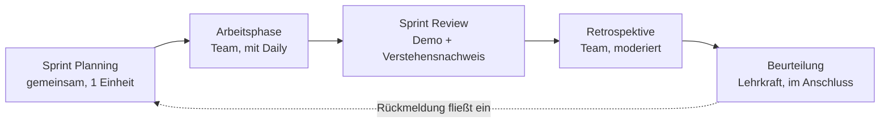
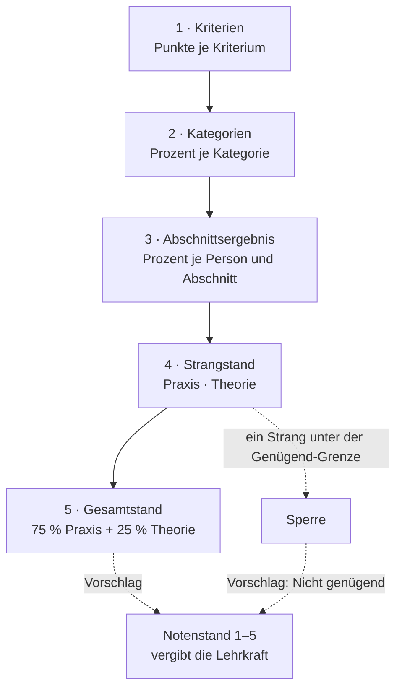

# Fachliches Konzept – Softwareprojekt in Sprints

| | |
|---|---|
| **Gegenstand** | Softwareprojekt (eigener Projektgegenstand) |
| **Dokument** | Fachliches Konzept für Unterricht und Leistungsbeurteilung |
| **Version** | 0.20 |
| **Datum** | 2026-09-10 |
| **Autor** | Gerald Hainbucher |
| **Status** | Entwurf – nicht freigegeben |
| **Gültig für Softwarestand** | 0.1.0 |
| **Zuletzt geprüft** | 2026-09-10 |
| **Nächste Prüfung** | Ende Sprint 1 |
| **Nachgelagert** | [Product Goal](product-goal.md) → [Anforderungen](anforderungen.md) |

---

## 1 Änderungshistorie

| Version | Datum | Autor | Änderung | Status |
|---|---|---|---|---|
| 0.1 | 2026-09-09 | G. Hainbucher | Ersterstellung: Kompetenzmodell, Sprintdidaktik, Beurteilungskonzept, Ableitung des Product Goals | Entwurf |
| 0.2 | 2026-09-09 | G. Hainbucher | Rollenmodell berichtigt: der Product Owner ist oft nicht die Lehrkraft. Folgen für Review, Produktbewertung und K3. Stellvertretende Erfassung der Auftraggeber-Rückmeldung. Stakeholderanalyse und Product Goal in eigene Dokumente ausgelagert. | Entwurf |
| 0.3 | 2026-09-10 | G. Hainbucher | Zeitraum berichtigt: 1. Oktober bis 30. April statt „ein Semester“. Zeitbudget von 3 Wochenstunden aufgenommen, Sprintrhythmus 2–4 Wochen mit Begründung der Progression, Overhead-Rechnung, Umgang mit Freizeitarbeit. Semestergrenze als offener Punkt. | Entwurf |
| 0.4 | 2026-09-10 | G. Hainbucher | OP-F8 und OP-F9 entschieden: Semesterbeurteilung aus dem Teilzeitraum ist zulässig; der Sprintfaktor folgt nicht der Sprintlänge | Entwurf |
| 0.5 | 2026-09-10 | G. Hainbucher | OP-F1 im Beurteilungsteil geklärt: Sprintbeurteilungen sind Mitarbeitsfeststellungen, jeder Sprint wird bewertet, keine formale Ankündigungspflicht. Verbleibender Teil zur Datenverarbeitung als OP-F10 abgetrennt. | Entwurf |
| 0.6 | 2026-09-10 | G. Hainbucher | OP-F10 entschieden: Verarbeitung von Schülerdaten auf Lehrergeräten ist zulässig. Damit sind alle Prüfaufträge vor der Freigabe erledigt. | Entwurf |
| 0.7 | 2026-09-10 | G. Hainbucher | OP-F2 entschieden: Peer-Werte wirken als gedeckelter Korrekturfaktor von höchstens ±5 Prozentpunkten | Entwurf |
| 0.8 | 2026-09-10 | G. Hainbucher | Grundsätze G8 bis G10 ergänzt: Aufzeichnungen ohne Noten, überspringbare Bewertungsebenen ohne Überschreiben, Zurückhaltung in der Darstellung. Kapitel 10 um die Bewertungspyramide erweitert. | Entwurf |
| 0.9 | 2026-09-10 | G. Hainbucher | Die Peer-Bewertung wird zugeschaltet, nicht vorausgesetzt (8.4). Der Zeitpunkt bleibt eine Einschätzung der Lehrkraft; das Werkzeug fragt am Sprintende nach. OP-F5 dadurch zurückgestellt. | Entwurf |
| 0.20 | 2026-09-11 | G. Hainbucher | Das Werkzeug heißt PRE/SYP-PRP-Bewertung; die Kürzel sind in Kapitel 3 einmal ausgeschrieben | Entwurf |
| 0.19 | 2026-09-10 | G. Hainbucher | Rückfallebene festgelegt, falls die KI-gestützte Korrektur nicht zulässig ist (3.6). OP-F15 wird im Nachgang geklärt und bleibt von OP-S3 getrennt | Entwurf |
| 0.18 | 2026-09-10 | G. Hainbucher | Arbeitsteilung der beiden Stränge ausdrücklich festgelegt (10.4); Einlesen von Testergebnissen als Anforderung FA-63 | Entwurf |
| 0.17 | 2026-09-10 | G. Hainbucher | Themenbezogene Kurztests statt weniger langer: fünf bis sechs je Semester, Aufbau 3 × Multiple Choice und eine offene Frage (20/20/20/40). KI-Korrektur als Vorschlag, pseudonymisiert (3.6). OP-F14 dadurch neu gefasst, OP-F15 neu | Entwurf |
| 0.16 | 2026-09-10 | G. Hainbucher | OP-F14 entschieden: mindestens ein, höchstens zwei Tests je Semester. Zeitrahmen des § 8 LBVO als Semestergrenze berichtigt | Entwurf |
| 0.15 | 2026-09-10 | G. Hainbucher | Der Gegenstand hat zwei Stränge: Praxis 75 %, Theorie 25 % mit 2–4 Tests im Jahr (neues Kap. 3.5). Ein negativer Strang sperrt die positive Gesamtbeurteilung (10.5, § 14 LBVO). Ankündigungspflicht für Tests berichtigt. OP-4 entschieden | Entwurf |
| 0.14 | 2026-09-10 | G. Hainbucher | OP-F3 entschieden: KI-Vermerk im Pull Request als Teil der Definition of Done, ausdrücklich nicht bewertet (9.1) | Entwurf |
| 0.13 | 2026-09-10 | G. Hainbucher | OP-F13 entschieden: Rubrik der zweiten Phase (neues Kap. 8.8). OP-F6 entschieden: Teams dürfen wechseln, die Zugehörigkeit wird je Abschnitt geführt | Entwurf |
| 0.12 | 2026-09-10 | G. Hainbucher | OP-F12 entschieden: Die Diplomarbeitsvorbereitung wird als weiterer Beurteilungsabschnitt mit eigener Rubrik erfasst. Neuer offener Punkt OP-F13 zu deren Kriterien | Entwurf |
| 0.11 | 2026-09-10 | G. Hainbucher | Der Gegenstand läuft bis Schuljahresende: ab Mai Diplomarbeitsvorbereitung (neues Kap. 3.4). Der 30. April ist Phasengrenze, nicht Beurteilungsstichtag. OP-F11 dadurch geklärt, OP-F12 zur Bewertung der zweiten Phase neu | Entwurf |
| 0.10 | 2026-09-10 | G. Hainbucher | OP-F4 entschieden auf Grundlage von § 20 Abs. 1 LBVO: Die zweite Hälfte der Sprints eines Beurteilungszeitraums zählt doppelt (neues Kap. 10.3). Rechtsgrundlagen und Quellenverzeichnis ergänzt (Kap. 14). Neuer offener Punkt OP-F11 zum Beurteilungszeitraum. | Entwurf |

> **Versionsregel:** Entwürfe `0.x`, mit der Freigabe `1.0`. Git-Tag `docs/fachkonzept-vX.Y`.
> Dieses Dokument steht **vor** dem Anforderungsdokument: Ändert sich das Fachkonzept, wird
> geprüft, ob das Product Goal und daraus abgeleitete Anforderungen nachzuziehen sind.

---

## 2 Zweck des Dokuments

Dieses Konzept beschreibt, **was im Unterricht geschieht und wie Leistung darin beurteilt
wird**. Es ist die fachliche Grundlage, aus der sich das Product Goal für die
Bewertungssoftware (PRE/SYP-PRP-Bewertung) ableitet – nicht umgekehrt.

Es dient drei Zwecken:

1. **Unterrichtsplanung** – der Ablauf eines Sprints und die Rollen darin sind festgelegt.
2. **Beurteilungsgrundlage** – Kompetenzen, Kriterien und Notenfindung sind vorab schriftlich
   fixiert und damit gegenüber Schülerinnen, Schülern, Erziehungsberechtigten und Aufsicht
   begründbar.
3. **Ableitung des Product Goals** – die Software bekommt einen Zweck, der aus der Didaktik
   stammt und nicht aus dem technisch Naheliegenden.

**Nicht Gegenstand** dieses Dokuments sind die Wahl der Programmiersprache, der konkrete
Projektauftrag eines Durchgangs und die Werkzeuglandschaft der Teams. Diese wechseln pro
Durchgang; das Konzept muss sie überdauern.

---

## 3 Rahmen

| Merkmal | Festlegung |
|---|---|
| Gegenstände | **PRE** – Projektentwicklung, **SYP** – Systemplanung, **PRP** – Projektpraktikum |
| Gegenstandsart | eigener Projektgegenstand; er trägt die Semester- und die Jahresnote |
| Gegenstandszeitraum | **Anfang Oktober bis Schuljahresende** |
| Phase 1 – Sprintprojekt | **1. Oktober bis 30. April** |
| Phase 2 – Diplomarbeitsvorbereitung | **Mai bis Anfang Juni** (siehe 3.4) |
| Wochenstunden | **4**, davon **3 Praxis** und **1 Theorie** (3.5) |
| Arbeitszeit am Projekt | **3 Wochenstunden** – die Hauptarbeitszeit und die einzige planbare Beobachtungszeit |
| Sprintlänge | 2 bis 4 Wochen, veränderlich (siehe 6.2) |
| Sprintanzahl | 7 bis 9, je nach gewähltem Rhythmus |
| Teamgröße | 3 bis 5 Personen |
| Produkt | ein über die Sprints wachsendes Softwareprodukt je Team |

Der Gegenstand hat damit **zwei Phasen mit einem gemeinsamen Zweck**: Phase 1 übt an einem
gestellten Auftrag, was Phase 2 mit einem echten verlangt. Beurteilt wird in beiden.

Quer dazu liegen **zwei Stränge**: die Praxis mit 3 Wochenstunden und die Theorie mit einer.
Sie gehen mit 75 zu 25 Prozent in die Note ein und sind gegeneinander nicht aufrechenbar
(3.5, 10.5).

Aus der Gegenstandsart folgt die zentrale Konsequenz dieses Konzepts: **Die Beurteilung
trägt die volle Last einer Jahresnote.** Sie muss deshalb auf mehreren, über den ganzen
Zeitraum verteilten Feststellungen beruhen, dokumentiert sein und im Anlassfall
rekonstruierbar bleiben. Das ist kein Komfortmerkmal, sondern die Bedingung dafür, dass die
Note hält.

### 3.1 Das Zeitbudget

Vom 1. Oktober bis zum 30. April liegen rund **30 Kalenderwochen**. Abzüglich Herbst-,
Weihnachts-, Semester- und Osterferien bleiben je nach Schuljahr etwa **25 Arbeitswochen**.

| Größe | Wert |
|---|---|
| Arbeitswochen | ~25 |
| Schulstunden je Woche | 3 |
| **Gesamtbudget je Person** | **~75 Schulstunden** |
| davon Sprint-Termine (Planning, Review, Retrospektive) | ~20 Stunden, siehe 6.2 |
| verbleibende Arbeitszeit am Produkt | ~55 Stunden |

Diese 75 Stunden sind die Bezugsgröße für alles Weitere: für die Schätzung im Planning
(K2.1), für den Umfang, den ein Sprint-Ziel haben darf, und für die Beurteilung. **Was ein
Team leistet, ist an diesem Budget zu messen, nicht an dem, was in einer Firma möglich wäre.**

### 3.2 Arbeit in der Freizeit

Erfahrungsgemäß wenden Schülerinnen und Schüler zusätzlich Zeit außerhalb der Schule auf.
Das ist realistisch und wird nicht verboten. Für die Beurteilung folgen daraus zwei Regeln:

**Der Umfang eines Sprint-Ziels wird so bemessen, dass er in der Schulzeit erreichbar ist.**
Freizeit ist Puffer und Ausdruck von Interesse, nicht Kalkulationsgrundlage. Wer sie nicht
aufbringen kann – wegen Fahrzeiten, Nebenbeschäftigung oder Betreuungspflichten –, darf
dadurch nicht in eine schlechtere Note geraten.

**Was außerhalb der Schule entsteht, ist nicht beobachtet.** Grundsatz G4 verlangt, dass
beurteilt wird, was beobachtet wurde. Für Arbeit in der Freizeit tritt an die Stelle der
Beobachtung die nachprüfbare Spur – Commits, Pull Requests, Board – und vor allem der
Verstehensnachweis im Review (8.3). Das ist kein Misstrauen, sondern die einzige Möglichkeit,
solche Arbeit überhaupt in die Beurteilung einzubeziehen.

### 3.3 Die Semestergrenze

Der Gegenstandszeitraum überspannt das Semesterende. Es braucht deshalb **zwei
Feststellungen**:

| Beurteilungszeitraum | Umfasst | Ende |
|---|---|---|
| 1. Semester | die bis Ende Jänner abgeschlossenen Sprints (etwa vier bis fünf) | Semesterzeugnis |
| 2. Semester | die Sprints von Februar bis 30. April **und** die Diplomarbeitsvorbereitung (3.4) | Jahreszeugnis |

**Der 30. April ist keine Beurteilungsgrenze.** Er trennt die beiden Phasen, mehr nicht. Die
Jahresbeurteilung entsteht Anfang Juni und stützt sich auf beide.

Die Semesterbeurteilung ist damit ein **Zwischenstand nach denselben Regeln**, kein eigenes
Verfahren. Das ist beabsichtigt: Ein Schüler, der im Februar eine 4 sieht, weiß, woran er
liegt, und hat bis Ende April Gelegenheit, das zu ändern.

**Geklärt:** Die Semesterbeurteilung aus dem Teilzeitraum ist in dieser Form zulässig
(Entscheidung vom 10. September 2026). Damit ist FA-48 – die Auswertung zu einem Stichtag –
keine Vorratsanforderung, sondern zweimal je Durchgang erforderlich.

**Verankerung im Schulrecht (geklärt am 10. September 2026):**

| Frage | Festlegung |
|---|---|
| Art der Leistungsfeststellung | **Mitarbeitsfeststellung** – sie genügt als Grundlage der Beurteilung |
| Mindestanzahl | unkritisch: **jeder Sprint wird bewertet**, also sieben bis neun Feststellungen je Durchgang |
| Ankündigung im Praxisstrang | **entfällt** – eine formale Ankündigung gilt für Schularbeiten und Prüfungen, nicht für Mitarbeit |
| Ankündigung im Theoriestrang | **erforderlich** – Tests sind schriftliche Überprüfungen und spätestens zwei Unterrichtstage vorher bekanntzugeben (§ 8 LBVO, siehe 3.5) |

Die Bekanntgabe der Beurteilungskriterien zu Schuljahresbeginn ist davon zu unterscheiden:
Sie ist keine formale Pflicht, sondern die Grundlage, auf der die Note im Anlassfall steht
(Grundsatz G1, FA-39).

Weil die Mitarbeitsfeststellung laufend erfolgt, verschiebt sich die Anforderung von der
Ankündigung zur **Auskunft**: Über den Leistungsstand ist auf Verlangen Auskunft zu geben.
Das deckt FA-42 ab – die Rückmeldung je Person nach jedem Sprint, bevor die Bewertung in die
Note eingeht.

### 3.4 Phase 2: die Diplomarbeitsvorbereitung

Ab Anfang Mai wechselt der Gegenstand den Gegenstand: Die Schülerinnen und Schüler suchen
ein Diplomarbeitsthema in der Wirtschaft, präsentieren es vor einem Lehrergremium und
erwirken bis Anfang Juni die Freigabe.

| Merkmal | Festlegung |
|---|---|
| Zeitraum | Mai bis Anfang Juni, etwa **4 Arbeitswochen** = ~12 Schulstunden |
| Ergebnis | freigegebenes Diplomarbeitsthema mit einem Auftraggeber aus der Wirtschaft |
| Stationen | Themensuche und Erstkontakt · Präsentation vor dem Gremium · Freigabe |
| Danach | rund zwei Wochen für notwendige Prüfungen und formale Aufgaben – **nicht beurteilt** |

**Das ist inhaltlich keine neue Baustelle.** Kompetenzbereich K3 – Projektabwicklung und
Kommunikation – beschreibt genau diese Phase: eine unklare Anforderung durch Rückfragen
klären (K3.1), Entscheidungen nachvollziehbar festhalten (K3.2), adressatengerecht in der
vereinbarten Zeit präsentieren (K3.3), Rückfragen ohne Ausweichen beantworten (K3.4), Risiken
benennen (K3.5). Was in Phase 1 an einem gestellten Auftraggeber geübt wird, gilt hier gegen
einen echten. **Das Kompetenzmodell bleibt daher unverändert; es fehlt nur die Rubrik.**

**Die Freigabe schließt den Beurteilungszeitraum.** Was danach kommt, ist zeitlich zwar noch
Unterricht, geht aber nicht in die Note ein. Praktisch heißt das: Anfang Juni muss der
Notenstand stehen – auch deshalb, weil die anschließenden zwei Wochen für Prüfungen
reserviert sind, die nur abhalten kann, wer die Gefährdung vorher kennt.

**Folge für die Frühwarnung.** Zeichnet sich ein Nicht genügend ab, ist gemäß § 19 Abs. 3a
SchUG [Q6] **unverzüglich** zu verständigen und ein beratendes Gespräch anzubieten. Eine
feste Frist nennt das Gesetz nicht – aber der letzte Zeitpunkt, zu dem eine Warnung noch
etwas bewirken kann, ist das **Ende der Sprintphase Ende April**. Danach bleiben vier
Arbeitswochen, in denen sich kaum mehr etwas drehen lässt.

Der 30. April ist damit zwar kein Beurteilungsstichtag (3.3), aber der wichtigste
**Kontrollpunkt** des zweiten Semesters. Die Auswertung zu einem Stichtag (FA-48) wird
deshalb dreimal gebraucht: Ende Jänner für das Semesterzeugnis, Ende April für die
Frühwarnung, Anfang Juni für das Jahreszeugnis.

**Erfasst wird sie als weiterer Beurteilungsabschnitt mit eigener Rubrik**
(entschieden am 10. September 2026, OP-F12).

Damit wird der **Beurteilungsabschnitt** der tragende Begriff, nicht mehr der Sprint: Ein
Sprint ist ein Abschnitt, die Diplomarbeitsvorbereitung ist ein anderer. Beide haben
dieselbe Struktur – Zeitraum, Team, Kriterien, Punkte, Prozentwert – und **je eine eigene
Rubrik**. Bisher galt eine Rubrik für alles.

Der Preis dieser Entscheidung ist ein Eingriff in den Datenbestand (Schemastand 2). Der
Gewinn ist, dass die Jahresnote in einem Stück belegbar bleibt und dieselbe Rechnung für
beide Phasen gilt – einschließlich Zeitfaktor, gesetzten Werten und Belegfassung. Die
Alternative, Phase 2 außerhalb zu beurteilen, hätte genau jenes Drittel der Note
undokumentiert gelassen, das dem Zeugnis am nächsten liegt (Risiko R-10).

Die Kriterien dieser zweiten Rubrik stehen in 8.8.

**Die Teams dürfen sich zur zweiten Phase ändern** – Diplomarbeitsgruppen entstehen nach
Thema und Interesse, nicht nach der Sprint-Einteilung. Die Teamzugehörigkeit wird deshalb
**je Abschnitt geführt** und nicht mehr als eine Eigenschaft der Person (6.1, FA-58). Damit
ist zugleich ein Teamwechsel während der Sprintphase abgedeckt, der bisher offen war
(OP-F6).

### 3.5 Der Theoriestrang

Eine der vier Wochenstunden ist Theorie. Sie läuft über das ganze Schuljahr parallel zu
beiden Phasen und wird über Tests beurteilt.

| Merkmal | Festlegung |
|---|---|
| Umfang | 1 Wochenstunde, rund 25 Schulstunden im Jahr |
| Leistungsfeststellung | **fünf bis sechs** kurze schriftliche Überprüfungen (Tests) **je Semester**, je 12 bis 15 Minuten, einer je Thema (3.6) |
| Mitarbeit | wird im Theoriestrang **nicht** gesondert festgestellt |
| Gewicht in der Note | **25 %** – eine von vier Wochenstunden |
| Verhältnis zur Praxis | eigener Strang, nicht aufrechenbar (10.4) |

**Viele kurze statt weniger langer** – entschieden am 10. September 2026 (OP-F14). Der
Ausgangspunkt war die Untergrenze: Ohne Test im ersten Semester hätte der Theoriestrang zum
Semesterzeugnis keinen Wert und die Sperre könnte dort nicht greifen. Die Antwort darauf ist
ausgefallen als ursprünglich gedacht, weil ein Test je Thema mehrere Probleme zugleich löst:
Die Sperre steht auf breiter Grundlage, ein schlechter Tag entscheidet nichts mehr, und der
Lernstand ist während des Semesters sichtbar statt danach.

**Tests sind anzukündigen.** Anders als die Mitarbeitsfeststellung sind schriftliche
Überprüfungen nach **§ 8 LBVO** [Q7] **spätestens zwei Unterrichtstage vorher**
bekanntzugeben. Die Aussage in 3.3, eine Ankündigung entfalle, gilt nur für die
Mitarbeitsfeststellung im Praxisstrang und ist dort entsprechend eingeschränkt.

**Der zeitliche Rahmen nach § 8 Abs. 4 und 5 LBVO** [Q7]:

| | |
|---|---|
| Höchstdauer je Überprüfung | 25 Minuten |
| Gesamtarbeitszeit je Gegenstand und **Semester** | 80 Minuten |

Die Grenze gilt **je Semester**, nicht je Jahr. Der Einleitungssatz von § 8 Abs. 5 lautet
„… in jedem Unterrichtsgegenstand und in jedem Semester …“; die Jahresgrenze von 50 Minuten
in lit. f betrifft ausschließlich Berufsschulen. Bei zwei Tests zu je 25 Minuten sind 50 von
80 Minuten verbraucht – der Rahmen ist nicht knapp.

**Die Rechnung mit dem Zeitbudget:**

| Testlänge | Tests je Semester | Rhythmus bei ~13 Theorieeinheiten |
|---|---|---|
| 12 Minuten | 6 | alle zwei Wochen |
| 15 Minuten | 5 | alle zwei bis drei Wochen |

Zwei Nebenbedingungen des § 8 LBVO sind bei so vielen Terminen mitzudenken:

- **Abs. 7:** An einem Schultag, an dem in der Klasse bereits eine Schularbeit oder eine
  schriftliche Überprüfung stattfindet, darf keine weitere stattfinden. Bei sechs Terminen im
  Semester ist eine Kollision wahrscheinlich – der Klassenkalender gehört in die Planung.
- **Abs. 6:** Nicht am ersten Tag nach mindestens drei zusammenhängenden schulfreien Tagen
  oder einer mehrtägigen Schulveranstaltung.

**Die Ankündigung erledigt der Semesterplan.** Zwei Unterrichtstage sind eine Mindestfrist,
keine Vorgabe. Ein Plan in der ersten Woche, der Themen und Testtermine nennt, kündigt alle
sechs auf einmal an – und ist zugleich das, was Grundsatz G1 ohnehin verlangt.

### 3.6 Aufbau eines Tests

Jeder Test hat denselben Aufbau: **drei Multiple-Choice-Fragen und eine offene Frage.**

| Teil | Gewicht | Punkte | Misst |
|---|---|---|---|
| MC 1 | 20 % | 2 | Erfassung des Lehrstoffs |
| MC 2 | 20 % | 2 | Erfassung des Lehrstoffs |
| MC 3 | 20 % | 2 | Erfassung des Lehrstoffs |
| **Offene Frage** | **40 %** | **4** | **Anwendung auf eine neue Situation** |
| | 100 % | 10 | |

**Warum die offene Frage 40 % trägt.** § 14 LBVO verlangt Erfassung **und** Anwendung des
Lehrstoffs. Automatisch auswertbare Formate messen fast nur das Erste. Weil der Theoriestrang
über die Sperre (10.4) die ganze Note tragen kann, wäre ein Nicht genügend, das
ausschließlich auf Ankreuzen beruht, die angreifbarste Stelle des ganzen Modells. Mit 40 %
ist die Anwendung der größte Einzelposten jedes Tests und nicht die Zugabe am Ende.

Die Aufteilung ist zugleich eine Aufwandsentscheidung: 60 % korrigieren sich von selbst,
40 % nicht.

#### Die Korrektur der offenen Frage

Die offene Frage wird mit **KI-Unterstützung** vorbereitet. Dafür gelten drei Regeln, und die
ersten beiden stehen nicht zur Disposition.

**1. Die Beurteilung bleibt bei der Lehrkraft.** § 11 Abs. 2 LBVO [Q3]: *„Der Lehrer hat die
Leistungen der Schüler sachlich und gerecht zu beurteilen.“* Die Rechtsprechung nennt das
eine pädagogische gutachterliche Tätigkeit [Q5]; sie ist nicht übertragbar. Die KI liefert
einen **Vorschlag je Antwort**, die Lehrkraft prüft und setzt den Wert. Das ist dasselbe
Muster wie zwischen Notenvorschlag und Notenstand (10.2) – Vorschlag daneben, Entscheidung
darüber, beides bleibt erhalten.

**2. Keine personenbezogenen Daten in das KI-Werkzeug.** Kapitel 9 verlangt das von den
Schülerinnen und Schülern; für die Lehrkraft gilt es zuerst. Die Korrektur läuft deshalb
**pseudonymisiert**: Die Blätter werden nummeriert, die Zuordnung bleibt bei der Lehrkraft,
zur Bewertung gehen nur die Antworttexte und das Bewertungsschema. Kein Name, keine Klasse,
kein Schulbezug.

**3. Ohne Bewertungsschema kein Vorschlag.** Zu jeder offenen Frage gehört ein Schema von 0
bis 4 Punkten mit Deskriptoren – dieselbe Form wie in der Rubrik. Ohne Schema ist eine
KI-Korrektur nicht wiederholbar und damit als Grundlage wertlos; mit Schema ist sie ein
brauchbarer erster Durchgang. Das Schema ist Teil der Aufzeichnungen und gehört in die
Belegfassung.

Grenzfälle sieht sich die Lehrkraft ohnehin an. Bei 25 Antworten sind das erfahrungsgemäß
eine Handvoll.

**Offen:** Ob die pseudonymisierte Verarbeitung von Prüfungsleistungen Minderjähriger über
einen Dienst Dritter zulässig ist, ist mit der Schulleitung zu klären – dieselbe Art von
Frage wie OP-F1 und OP-F10 und keine, die die Entwicklung beantworten kann (OP-F15). Die
Klärung erfolgt **im Nachgang**, nicht vor dem Start.

#### Wenn die KI-Korrektur nicht zulässig ist

Diese Klärung darf den Beginn nicht aufhalten, und sie tut es auch nicht – weil die
Rückfallebene vorher feststeht:

| | mit KI-Vorschlag | ohne |
|---|---|---|
| Tests je Semester | fünf bis sechs | **weniger**, im Zweifel zwei |
| Offene Frage | eine je Test | **kürzer oder seltener** |
| Korrektur | Vorschlag, von der Lehrkraft geprüft und gesetzt | **vollständig von Hand** |
| Eintragen | aus einer Datei (FA-63) oder von Hand | von Hand |

Was sich **nicht** ändert: der Aufbau der Beurteilung. Stränge, Gewichte, Sperre, die 40 %
für die offene Frage – alles bleibt. Weniger Tests heißen eine schmalere Grundlage für den
Theoriestrang (Risiko R-11), nicht ein anderes Modell.

**Die PRE/SYP-PRP-Bewertung ist von dieser Frage nicht betroffen.** Die Anwendung spricht mit keinem
KI-Dienst; sie nimmt Punkte entgegen, gleich wer sie ermittelt hat. Die Entscheidung
verändert den Unterrichtsbetrieb, nicht die Software – und deshalb hält sie nichts auf.

---

## 4 Leitidee

Der Gegenstand bildet die Berufswirklichkeit ab, nicht eine vereinfachte Schulform davon.
Das heißt konkret:

- Es gibt **einen Auftraggeber**, der Anforderungen stellt, priorisiert und abnimmt – nicht
  eine Angabe, die abgearbeitet wird. Das kann die Lehrkraft sein, eine Kollegin, ein Kollege
  oder ein externer Partner; in der Praxis kommen alle Kombinationen vor.
- Es gibt **ein Team**, das sich selbst organisiert, Aufgaben verteilt und für das Ergebnis
  gemeinsam einsteht.
- Es gibt **einen Takt**: planen, arbeiten, liefern, zeigen, reflektieren. Der Takt ist nicht
  Beiwerk, sondern der Lerngegenstand.
- Es gibt **echte Werkzeuge**: Versionsverwaltung, Pull Requests, Tests, Pipeline, und
  KI-Assistenz. Was in der Praxis verwendet wird, wird auch hier verwendet.

Daraus folgt die Beurteilungshaltung: Bewertet wird nicht, wie viel jemand getippt hat,
sondern **was das Team liefert, wie es dabei arbeitet, und wofür die einzelne Person darin
einsteht**.

Und daraus folgt eine zweite Trennung, die für die Beurteilung wesentlich ist: **Der
Auftraggeber nimmt ab, die Lehrkraft beurteilt.** Ist der Product Owner nicht die Lehrkraft,
so ist seine Abnahme *Evidenz für* die Beurteilung, nicht die Beurteilung selbst. Beurteilt
werden **Prozess und Produkt** – nicht, ob die Anforderungen des Auftraggebers gut waren.

---

## 5 Kompetenzmodell

Vier Kompetenzbereiche. Sie sind die oberste Gliederungsebene und bleiben über Durchgänge
hinweg stabil; die Deskriptoren darunter werden geschärft, wenn die Praxis es zeigt.

### K1 Produkt und Handwerk

*Der Schüler / die Schülerin kann funktionierende Software erstellen, die den vereinbarten
Anforderungen entspricht und von anderen weiterentwickelt werden kann.*

| Nr. | Deskriptor |
|---|---|
| K1.1 | setzt User Stories so um, dass die vereinbarten Akzeptanzkriterien erfüllt sind |
| K1.2 | strukturiert Code nachvollziehbar, hält Namenskonventionen und Projektstandards ein |
| K1.3 | schreibt Tests, die den fachlichen Kern der eigenen Umsetzung absichern |
| K1.4 | nutzt Versionsverwaltung fachgerecht: aussagekräftige Commits, Branches, Pull Requests |
| K1.5 | grenzt einen Fehler systematisch ein, findet die Ursache und sichert die Behebung mit einem Test ab |
| K1.6 | dokumentiert so, dass eine fremde Person das Projekt aufsetzen und die Architektur verstehen kann |

### K2 Prozess und Zusammenarbeit

*… kann in einem selbstorganisierten Team nach einem agilen Rahmenwerk arbeiten.*

| Nr. | Deskriptor |
|---|---|
| K2.1 | schätzt den eigenen Aufwand realistisch und sagt nur zu, was im Sprint machbar ist |
| K2.2 | hält das Board aktuell und macht den eigenen Arbeitsstand von außen sichtbar |
| K2.3 | benennt Hindernisse früh, statt sie bis zum Sprintende zu tragen |
| K2.4 | gibt und nimmt fachliche Rückmeldung im Code Review sachlich |
| K2.5 | leitet aus der Retrospektive konkrete Maßnahmen ab und setzt sie im Folgesprint um |
| K2.6 | übernimmt Verantwortung für das Teamergebnis, auch für nicht selbst geschriebene Teile |

### K3 Projektabwicklung und Kommunikation

*… kann ein Softwareprojekt von der Anforderung bis zur Übergabe abwickeln und gegenüber
einem Auftraggeber vertreten.*

| Nr. | Deskriptor |
|---|---|
| K3.1 | erkennt eine unklare Anforderung und klärt sie durch gezielte Rückfragen, statt zu raten |
| K3.2 | hält Anforderungen und Entscheidungen schriftlich so fest, dass sie später nachvollziehbar sind |
| K3.3 | präsentiert ein Arbeitsergebnis adressatengerecht und in der vereinbarten Zeit |
| K3.4 | beantwortet Rückfragen zum eigenen Ergebnis fachlich und ohne Ausweichen |
| K3.5 | schätzt Risiken des eigenen Vorgehens ein und benennt sie gegenüber dem Auftraggeber |

### K4 Reflexion und Eigenverantwortung

*… kann die eigene Arbeit einschätzen, Werkzeuge verantwortet einsetzen und daraus lernen.*

| Nr. | Deskriptor |
|---|---|
| K4.1 | schätzt den eigenen Beitrag realistisch ein – ohne Über- und ohne Untertreibung |
| K4.2 | erklärt und verteidigt jeden Codeteil, den er oder sie eingebracht hat, unabhängig von seiner Entstehung |
| K4.3 | setzt KI-Werkzeuge gezielt ein, prüft deren Ergebnis und erkennt, wo es nicht passt |
| K4.4 | hält die Regeln zum Umgang mit Daten und fremdem Code ein |
| K4.5 | zieht aus Rückmeldungen des Vorsprints eine erkennbare Konsequenz |

**Verhältnis der Bereiche:** K1 und K2 sind der Kern des Gegenstands. K3 bereitet die
Diplomarbeit vor und wird über die Sprints hinweg schwerer gewichtet. K4 ist die Klammer –
er ist der Bereich, der unter Einsatz von KI-Werkzeugen an Bedeutung gewinnt und ohne
mündliche Situation nicht feststellbar ist (siehe Kapitel 8.3).

---

## 6 Der Sprint als didaktische Einheit

| Termin | Dauer | Wer | Was dabei entsteht |
|---|---|---|---|
| **Sprint Planning** | 1 Einheit | Team mit dem Auftraggeber | Sprint-Ziel, gefülltes Sprint Backlog mit Schätzungen und Akzeptanzkriterien |
| **Arbeitsphase** | 2–4 Wochen à 3 Einheiten | Team, Lehrkraft begleitet | Code, Tests, Doku; Board und Commits als laufende Spur |
| **Daily** | 5–10 min, zu Beginn jeder Einheit | Team | Stand, Vorhaben, Hindernisse |
| **Sprint Review** | 1 Einheit | Team vor Lehrkraft und Auftraggeber | lauffähige Demo, Abnahme der Stories, **Verstehensnachweis je Person** |
| **Retrospektive** | ½ Einheit | Team, moderiert | 2–3 konkrete Maßnahmen für den Folgesprint |
| **Beurteilung** | außerhalb der Einheiten | Lehrkraft | Sprintbewertung je Team und Person, Rückmeldung |

Das Daily findet zu Beginn jeder der drei Wocheneinheiten statt – nicht täglich. Das ist
eine Anpassung an den Schulrhythmus und wird den Teams auch so erklärt: Der Zweck bleibt
derselbe, die Frequenz folgt der verfügbaren Zeit.

### 6.1 Rollen

| Rolle | Besetzung | Anmerkung |
|---|---|---|
| Product Owner / Auftraggeber | Lehrkraft, Kollegin oder Kollege, oder extern | stellt Anforderungen, priorisiert, nimmt ab. **Beurteilt nicht.** |
| Lehrkraft (wenn nicht PO) | begleitet und beurteilt | beobachtet Prozess und Produkt, führt den Verstehensnachweis, bildet die Note |
| Scrum Master | Schüler / Schülerin, **rotierend je Sprint** | dadurch durchläuft jede Person die Moderationsrolle mindestens einmal |
| Entwicklungsteam | alle Teammitglieder | keine festen Spezialisierungen über den ganzen Zeitraum |

Fällt die Rolle des Auftraggebers mit der Lehrkraft zusammen, ist zu beachten, dass sie dann
ihre eigene Anforderungsarbeit mitbeurteilt. Auch in diesem Fall bleibt die Trennung im Kopf
bestehen: bewertet werden Prozess und Produkt, nicht die Passung zur eigenen Vorstellung.

Die Rotation der Scrum-Master-Rolle ist bewusst gesetzt: Sie erzeugt für jede Person eine
Situation, in der K2 und K3 beobachtbar werden, und verhindert, dass sich eine Person
dauerhaft hinter dem Team verbirgt.

**Die Teamzugehörigkeit gilt je Abschnitt, nicht je Person.** Ein Wechsel ist zulässig –
zwischen zwei Sprints, wenn es der Verlauf erfordert, und regelmäßig zur zweiten Phase, in
der sich die Gruppen nach Thema neu bilden (3.4).

Für die Beurteilung ändert das nichts: Die Note gehört der Person und sammelt sich über alle
Abschnitte, unabhängig davon, in welchem Team sie diese verbracht hat (G2). Für die
Belegfassung ändert es etwas – dort ist je Abschnitt auszuweisen, in welchem Team die Person
war, sonst ist ein Teamergebnis später nicht mehr zuzuordnen (FA-32, FA-58).

### 6.2 Sprintlänge und Rhythmus

Sprints dauern **2 bis 4 Wochen** und sind unterschiedlich lang. Drei Regeln bestimmen die
Länge:

1. **Am Anfang kurz.** In den ersten Sprints ist der Takt selbst der Lerngegenstand. Wer
   zweimal geplant, geliefert und reflektiert hat, hat mehr verstanden als jemand, der einmal
   vier Wochen gearbeitet hat.
2. **Später länger.** Sobald der Takt sitzt, gewinnt zusammenhängende Arbeitszeit. Längere
   Sprints erlauben größere Vorhaben und senken den Anteil der Termine am Zeitbudget.
3. **Bei erhöhtem Risiko wieder kürzer.** Neue Technologie, ein wackliges Team, eine unklare
   Anforderung: Ein kurzer Sprint begrenzt den Schaden und schafft früher einen Prüfpunkt.
   Die Sprintlänge ist damit ein Steuerungsinstrument der Lehrkraft, keine Formalie.

**Der Preis kurzer Sprints ist rechnerisch fassbar.** Planning, Review und Retrospektive
kosten zusammen etwa 2,5 Einheiten je Sprint. Bei 3 Einheiten pro Woche heißt das:

| Sprintlänge | Einheiten gesamt | davon Termine | Anteil |
|---|---|---|---|
| 2 Wochen | 6 | 2,5 | **42 %** |
| 3 Wochen | 9 | 2,5 | 28 % |
| 4 Wochen | 12 | 2,5 | 21 % |

Ein Zwei-Wochen-Sprint verbraucht also mehr als vier Zehntel seiner Zeit für sich selbst.
Das ist zu Beginn vertretbar, weil genau diese Termine der Lerngegenstand sind – dauerhaft
wäre es Verschwendung. Bei Zwei-Wochen-Sprints lassen sich Review und Retrospektive in einer
Einheit zusammenlegen; der Anteil sinkt damit auf 25 %.

**Ein möglicher Rhythmus** über 25 Arbeitswochen:

| Sprint | Länge | Zweck |
|---|---|---|
| 1 | 2 Wochen | Lernsprint: Werkzeuge, Team, Takt – Faktor 0,5 (6.4) |
| 2 | 2 Wochen | Takt festigen, erste echte Lieferung |
| 3 | 3 Wochen | erster größerer Funktionsblock |
| 4 | 3 Wochen | Abschluss vor der Semestergrenze |
| 5 | 4 Wochen | |
| 6 | 4 Wochen | |
| 7 | 4 Wochen | |
| 8 | 3 Wochen | Abschluss, Übergabe, Präsentation |

Zusammen 25 Wochen, acht Feststellungen. Der Rhythmus ist ein Vorschlag, kein Plan – Ferien,
Risiko und Projektverlauf verschieben ihn.

### 6.3 Der Review ist die stärkste Beobachtungssituation

Sitzt im Review ein Auftraggeber, der nicht die Lehrkraft ist, entsteht eine Situation, die
sich nicht künstlich herstellen lässt: Das Team steht einem echten Gegenüber Rede und
Antwort. Wie es mit Rückfragen umgeht, mit Kritik, mit einer missverstandenen Anforderung –
das ist unmittelbar beobachtbar und deckt die Deskriptoren K3.3 und K3.4 ab.

Die Lehrkraft beobachtet dort, statt zu prüfen. Der Verstehensnachweis (8.3) bleibt davon
getrennt und liegt bei der Lehrkraft; er ist nicht Sache des Auftraggebers.

### 6.4 Der erste Sprint ist ein Lernsprint

Sprint 1 dient der Einarbeitung in Werkzeuge, Team und Verfahren. Er wird vollständig
bewertet und rückgemeldet, geht aber mit **halbem Gewicht** in das Gesamtergebnis ein. Die
Begründung ist didaktisch, nicht kulant: Zu Beginn wird das Verfahren selbst noch gelernt;
eine volle Gewichtung würde die Anfangsunsicherheit statt der Kompetenz messen.

---

## 7 Beurteilungsgrundsätze

Diese zehn Grundsätze sind die Verfassung des Beurteilungskonzepts. Alles Weitere – auch
die Software – muss sich an ihnen messen lassen.

**G1 Kriterien sind vorher bekannt.** Die vollständige Rubrik wird zu Projektbeginn
ausgegeben und besprochen. Wer nicht weiß, woran gemessen wird, kann sein Handeln nicht
danach ausrichten – und die Note ist im Anlassfall angreifbar.

**G2 Team- und Einzelleistung werden getrennt erhoben.** Das Produkt entsteht gemeinsam, die
Note ist individuell. Beides gleichzusetzen wäre für starke wie für schwache Mitglieder
ungerecht.

**G3 Der Prozess zählt, nicht nur das Ergebnis.** Ein Team, das planvoll arbeitet und ein
Ziel verfehlt, hat mehr gelernt als eines, das zufällig liefert. Der Prozessanteil ist
deshalb eigenständig ausgewiesen.

**G4 Beurteilt wird, was beobachtet wurde.** Grundlage sind Artefakte (Repository, Board,
Doku), die Demo, das Gespräch im Review und die laufende Begleitung – nicht Eindrücke.

**G5 Rückmeldung vor Note.** Nach jedem Sprint erhält jedes Team und jede Person eine
Rückmeldung, bevor die Bewertung in die Note eingeht. Formatives und summatives
Beurteilen sind getrennt, aber verbunden: Der Folgesprint ist die Gelegenheit zur
Verbesserung. Die Rückmeldung beantwortet drei Fragen – **wo stehe ich, was ist gut, woran
arbeite ich** – und nicht mehr (G10).

**G6 Entwicklung wird abgebildet.** Über den Projektzeitraum steigende Leistung soll sichtbar
werden. Der Lernsprint zählt halb; ob spätere Sprints stärker gewichtet werden, ist
Gestaltungsspielraum der Lehrkraft und wird zu Projektbeginn festgelegt.

**G7 Jede Note ist rekonstruierbar.** Zu jeder Note lässt sich zeigen, aus welchen
Kriterien, Punkten und Beobachtungen sie entstanden ist – ohne Nachrechnen von Hand und
ohne Erinnerungsleistung.

**G8 Die Aufzeichnungen enthalten keine Noten.** Festgehalten werden Punkte und
Prozentwerte, nie Ziffern von 1 bis 5. **Die Note vergibt die Lehrkraft.** Ein Werkzeug darf
sie vorschlagen; die Beurteilung selbst ist ein Akt der Lehrkraft und kein Rechenergebnis
(siehe 10.1).

**G9 Jede Ebene ist überspringbar, keine wird überschrieben.** Von der Einzelbewertung bis
zum Notenstand darf auf jeder Stufe ein Wert unmittelbar gesetzt werden, ohne die Stufe
darunter auszufüllen. Der gesetzte Wert **tritt neben den berechneten**, er ersetzt ihn
nicht – und eine spätere Neuberechnung verdrängt einen gesetzten Wert nicht. So bleibt im
Anlassfall beides sichtbar: was gerechnet worden wäre und was entschieden wurde.

**G10 Weniger anzeigen als vorhanden ist.** Standardmäßig wird ein Wert und seine Einordnung
gezeigt, nicht die Herleitung. Die Herleitung ist abrufbar, nicht aufgedrängt – für die
Lehrkraft wie für die Schülerinnen und Schüler. Zu viele Zahlen führen von der Frage weg,
um die es geht: **Wo stehen wir, was ist gut, woran arbeiten wir?**

---

## 8 Beurteilungsinstrumente

Jedes Instrument liefert Evidenz für bestimmte Kompetenzbereiche. Kein Bereich hängt an
einem einzigen Instrument.

| Instrument | Erhebung | Deckt ab | Ebene |
|---|---|---|---|
| **Produktrubrik** | nach dem Review, anhand von Repository und Demo | K1 | Team |
| **Prozessrubrik** | laufend, aus Board, Commits, Terminen | K2 | Team |
| **Individueller Beitrag** | laufend, aus Aufgaben, Commits, Reviews | K1, K2 | Person |
| **Verstehensnachweis** | im Review, mündlich | K1.5, K3.4, K4.2 | Person |
| **Peer- und Selbsteinschätzung** | am Sprintende, schriftlich | K2, K4.1 | Person |
| **Reflexionsnotiz** | am Sprintende, kurz | K4.5 | Person |
| **Rückmeldung des Auftraggebers** | nach dem Review, von der Lehrkraft erfasst (8.7) | K3 | Team |

### 8.1 Produkt- und Prozessrubrik

Kriteriengeleitete Punktevergabe auf Teamebene. Die Rubrik ist über den Durchgang stabil –
Änderungen mitten im Durchgang entwerten frühere Sprints und sind zu vermeiden.

**Was die Produktnote trägt, ist auftraggeberunabhängig.** Haben verschiedene Teams
verschiedene Auftraggeber, sind deren Ansprüche nicht vergleichbar; eine Note, die daran
hinge, wäre angreifbar. Die Rubrik misst deshalb, was unabhängig davon prüfbar ist:
Handwerk, Prozess, Dokumentation – und ob das Team gehalten hat, was es **selbst** zugesagt
hat. „Zugesagt und geliefert“ tritt an die Stelle von „Anforderung erfüllt“; das ist auch
in der Praxis der Maßstab, der zählt.

### 8.2 Individueller Beitrag

Erhebt Umfang und Anspruch der übernommenen Aufgaben, Selbstständigkeit, Termintreue und den
Beitrag zur Teamarbeit. Grundlage sind nachvollziehbare Spuren – zugeordnete Stories,
Commits, Reviews – nicht der Gesamteindruck.

### 8.3 Verstehensnachweis

**Das zentrale Instrument unter Bedingungen des KI-Einsatzes.** Im Review erklärt jede Person
eine selbst eingebrachte Codestelle, beantwortet zwei Rückfragen dazu und begründet eine
Entscheidung, die auch anders hätte ausfallen können. Dauer: zwei bis drei Minuten pro
Person.

Der Nachweis prüft nicht, *wie* der Code entstanden ist – das ist weder feststellbar noch
relevant –, sondern ob die Person dafür einstehen kann. Er ist damit gegenüber jeder
Werkzeugentwicklung robust und entspricht zugleich der beruflichen Praxis, in der niemand
Code verantwortet, den er nicht erklären kann.

### 8.4 Peer- und Selbsteinschätzung

Jedes Teammitglied schätzt die anderen und sich selbst auf einer Skala ein. Die Peer-Werte
sind ein **Signal, keine Note**: Sie fließen nur gering gewichtet ein und dienen vor allem
dazu, Auffälligkeiten sichtbar zu machen – ein Mitglied, das das Team durchgehend anders
sieht als die Lehrkraft, oder eine Selbsteinschätzung, die weit von der Fremdeinschätzung
abweicht. Beides ist ein Anlass für ein Gespräch, nicht für einen Punkteabzug.

**Entschieden am 10. September 2026: gedeckelter Korrekturfaktor.** Die Peer-Werte gehen
nicht als gewichtete Kategorie in die Note ein, sondern verändern das Sprintergebnis um
höchstens ±5 Prozentpunkte. Neutraler Punkt ist ein Peer-Ergebnis von 50 %.

Begründung: Die Deckelung begrenzt den Schaden im Missbrauchsfall, **ohne dass der Missbrauch
erkannt werden muss**. Die lineare Einrechnung setzt voraus, dass eine Absprache oder eine
gezielte Abwertung auffällt – und genau das ist von außen kaum zu sehen. Der Preis ist, dass
die Peer-Bewertung auch bei ehrlichen Teams nur halb so stark wirkt; das ist im Sinne von
ZK-3 hinnehmbar, weil ihre eigentliche Wirkung im Gespräch liegt.

**Nicht von Anfang an.** Die Peer-Bewertung wird **zugeschaltet, nicht vorausgesetzt**. Sie
setzt voraus, dass das Team tatsächlich nach Sprintlogik arbeitet – sonst schätzen sich vier
Personen gegenseitig für etwas ein, das noch niemand tut, und das Ergebnis ist Rauschen. Ein
Instrument, das beim ersten Einsatz Rauschen liefert, wird danach nicht mehr ernst genommen.

Der Zeitpunkt ist **keine Regel und kein Rechenwert**, sondern eine Einschätzung der
Lehrkraft. Das Werkzeug fragt am Ende jeder abgeschlossenen Sprintbewertung nach, ob die
Peer-Bewertung ab dem nächsten Sprint laufen soll (FA-53), und schaltet selbst nichts um.
Vorgabe für einen neuen Sprint ist **aus** (FA-52).

Der Klasse wird das vorher gesagt – als Begründung, nicht als Ankündigung einer Verschärfung:
Solange das Vorgehen noch eingeübt wird, fehlt der gegenseitigen Einschätzung die gemeinsame
Grundlage.

### 8.5 Reflexionsnotiz

Drei bis fünf Sätze am Sprintende: Was habe ich beigetragen, was habe ich gelernt, was
nehme ich mir für den nächsten Sprint vor. Kurz genug, dass es gemacht wird; konkret genug,
dass K4.5 im Folgesprint überprüfbar ist.

### 8.6 Zwei Ausgaben, zwei Zwecke

Aus G10 folgt eine Trennung, die sonst leicht untergeht: Was die Lehrkraft im Anlassfall
braucht und was der Schülerin nützt, ist nicht dasselbe Dokument.

| | **Rückmeldung an die Person** | **Belegfassung** |
|---|---|---|
| Zweck | weiterarbeiten | begründen, im Anlassfall belegen |
| Empfänger | Schülerin, Schüler | Lehrkraft, Aufsicht, Erziehungsberechtigte auf Verlangen |
| Inhalt | Stand, zwei bis drei Stärken, ein bis zwei Entwicklungsfelder, Vereinbarung für den Folgesprint | vollständige Herleitung: Kriterien, Punkte, Kategorien, gesetzte Werte samt Kennzeichnung |
| Zahlen | ein Prozentwert, keine Punktetabelle | alle |
| Anlass | nach jedem Sprint | auf Verlangen |

Die Belegfassung entsteht **aus denselben Daten**, sie wird nicht zusätzlich geschrieben
(Zielkonflikt ZK-1). Sie ist vorhanden, aber nicht der Normalfall.

### 8.7 Rückmeldung des Auftraggebers

Der Auftraggeber gibt im Review Rückmeldung und nimmt ab. Diese Rückmeldung ist ein **eigenes,
gering gewichtetes Signal** – sie ersetzt nicht die Produktrubrik (siehe 8.1).

**Erfassung in der ersten Ausbaustufe durch die Lehrkraft**, stellvertretend. Der
Auftraggeber bedient kein Werkzeug; ein eigener Zugang würde ein Backend erfordern und die
Rahmenbedingungen aufheben.

Dabei wird die **Herkunft mitgeführt**: Ist die Lehrkraft selbst Auftraggeber, ist die
Rückmeldung eigene Beobachtung; sonst ist sie eine protokollierte Fremdangabe. Für Grundsatz
G4 und für einen Widerspruchsfall ist dieser Unterschied wesentlich – und er kostet ein
Auswahlfeld.

### 8.8 Die Rubrik der zweiten Phase

Die Diplomarbeitsvorbereitung (3.4) wird mit einer **eigenen Rubrik** beurteilt. Sie nutzt
dieselben Kategorien wie die Sprint-Rubrik, füllt sie aber anders.

**Team – das gemeinsame Ergebnis (30 Punkte)**

| Nr. | Kriterium | Beschreibung | Max |
|---|---|---|---|
| d1 | Themenqualität | fachlicher Anspruch, Abgrenzung, Umsetzbarkeit im verfügbaren Zeitrahmen | 12 |
| d2 | Auftragsklarheit | realer Auftraggeber vorhanden, seine Erwartung schriftlich festgehalten (K3.1, K3.2) | 10 |
| d3 | Präsentation | Aufbau, Verständlichkeit, vereinbarte Zeit eingehalten (K3.3) | 8 |

**Prozess – das Vorgehen (20 Punkte)**

| Nr. | Kriterium | Beschreibung | Max |
|---|---|---|---|
| p1 | Akquise | eigenständige Suche, Beharrlichkeit nach Absagen, Qualität der Kontaktaufnahme | 8 |
| p2 | Absprachen festhalten | Gesprächsnotizen, Zusagen schriftlich, nachvollziehbar (K3.2) | 6 |
| p3 | Termintreue | die Zwischenschritte bis zur Präsentation wurden gehalten | 6 |

**Individuell (25 Punkte)**

| Nr. | Kriterium | Beschreibung | Max |
|---|---|---|---|
| i1 | Anteil an der Themenfindung | eigener Beitrag zu Suche und Zuschnitt, im Verhältnis zum Team | 8 |
| i2 | Auftritt im Gremium | eigener Redeanteil, Adressatenbezug (K3.3) | 7 |
| i3 | Rückfragen | beantwortet fachlich und ohne Ausweichen (K3.4) | 6 |
| i4 | Risiken benennen | kennt die Risiken des eigenen Themas und spricht sie von sich aus an (K3.5) | 4 |

**Peer:** unverändert übernommen, aber standardmäßig **aus** (FA-52). Vier Arbeitswochen mit
wechselnd zusammengesetzten Gruppen tragen keine belastbare gegenseitige Einschätzung.

**Gewichte: Team 30 · Prozess 20 · Individuell 50.**

Das ist der auffälligste Unterschied zur Sprint-Rubrik (45 / 20 / 35), und er ist begründet:
In einem Sprint bleibt ein Teil des individuellen Beitrags unsichtbar, weil vieles am eigenen
Rechner entsteht. In dieser Phase steht die Person vor einem Gremium und beantwortet
Rückfragen – die dichteste individuelle Beobachtung des ganzen Jahres. **Wo besser beobachtet
wird, darf höher gewichtet werden** (G4).

Elf Kriterien statt neunzehn. Vier Arbeitswochen tragen keine feingliedrige Rubrik.

#### Zwei Kriterien, die bewusst fehlen

**Die Freigabe selbst wird nicht bewertet.** Sie ist die Entscheidung eines anderen Gremiums.
Sie zum Kriterium zu machen hieße, einen Teil der Note an ein fremdes Votum zu hängen –
derselbe Einwand wie bei ZK-4 gegenüber dem Product Owner. Beurteilt wird die Arbeit *auf die
Freigabe hin*. Ob sie im ersten Anlauf kommt, kann an Umständen liegen, die niemand im Team
zu verantworten hat.

**„Hat einen Auftraggeber gefunden“ ist kein Kriterium.** Wer in einer Gegend ohne
einschlägige Betriebe sucht oder dreimal abgewiesen wird, hat nicht weniger geleistet.
Deshalb steht in p1 die Beharrlichkeit und nicht das Ergebnis – dieselbe Logik wie bei
Risiko R-09.

---

## 9 Umgang mit KI-Werkzeugen

Der Einsatz von KI-Assistenz ist **erwünscht**, weil er der beruflichen Praxis entspricht.
Daraus folgt kein eigenes Bewertungskriterium – Werkzeugbuchhaltung misst kein Können –
sondern eine Verschiebung der Beweislast:

| Regel | Begründung |
|---|---|
| Wer etwas einbringt, kann es erklären (K4.2) | Verantwortung ist nicht delegierbar; geprüft im Verstehensnachweis |
| Keine personenbezogenen Daten und keine Zugangsdaten in KI-Werkzeuge | Betriebsregel, gilt im Beruf genauso |
| Fremder Code wird auf Lizenz und Passung geprüft, bevor er übernommen wird | Sorgfaltspflicht |
| Nichts wird committet, was niemand im Team versteht | Wartbarkeit des Produkts |

Diese Regeln gehören in die Definition of Done des Gegenstands, nicht in die Rubrik.

### 9.1 Der Vermerk im Pull Request

**Entschieden am 10. September 2026 (OP-F3):** Wesentlich mit KI entstandene Teile werden im
Pull Request kurz vermerkt. Der Vermerk gehört in die Definition of Done und **ausdrücklich
nicht in die Bewertung**.

Eine Zeile in der Pull-Request-Vorlage genügt:

> **KI-Einsatz:** Welche Teile sind wesentlich mit KI entstanden, und wie hast du sie geprüft?

Keine Prozentangaben, keine Zeilenzählung. Die Frage, ab wann ein Anteil „größer“ ist, lässt
sich nicht beantworten, und jeder Versuch einer Schwelle erzeugt Streit über die Schwelle
statt Nachdenken über den Code.

**Wozu der Vermerk gut ist**

| Nutzen | |
|---|---|
| **Prüfanlass** | Wer hinschreiben muss, wie er einen generierten Teil geprüft hat, liest ihn dabei noch einmal. Der Gewinn entsteht beim Schreiben, nicht beim Lesen. |
| **Ansatzpunkt für den Verstehensnachweis** | Die Lehrkraft fragt dort, wo die Person selbst angegeben hat, den Code nicht geschrieben zu haben. Das trifft besser als eine zufällig aufgeschlagene Stelle (8.3). |
| **Normalisierung** | Ohne Vermerk gilt stillschweigend, dass KI-Einsatz etwas ist, worüber man nicht spricht. Genau das ist nicht gewollt. |
| **Berufliche Praxis** | In Betrieben wird eine solche Angabe zunehmend verlangt, auch aus Lizenz- und Haftungsgründen. |

**Warum er nichts kostet und nichts einbringt**

Der Vermerk ist nicht überprüfbar. Wer ihn weglässt, fällt nicht auf. Eine Regel, deren Bruch
folgenlos bleibt, erzieht zum Ignorieren – **es sei denn, sie ist erkennbar nicht als
Kontrolle gemeint.** Genau deshalb steht er nicht in der Rubrik: Sobald der Vermerk Punkte
kostet, entsteht ein Anreiz zu schweigen, und die Regel erreicht das Gegenteil ihres Zwecks.

Er bleibt damit eine Selbstverpflichtung. Das ist keine Schwäche der Regel, sondern ihre
Bedingung. Gedeckt ist der Fall ohnehin anders: Wer für seinen Code nicht einstehen kann,
zeigt das im Verstehensnachweis – ganz gleich, ob er etwas vermerkt hat (K4.2, PN-3).

**Für dieses Werkzeug selbst gilt dasselbe.** Dieses Werkzeug entsteht mit KI-Unterstützung; die
Pull-Request-Vorlage des Projekts führt denselben Vermerk. Eine Regel, die für den Unterricht
gilt und für den Unterrichtenden nicht, hält kein Schuljahr.

---

## 10 Notenfindung

### 10.1 Die Bewertungspyramide

Fünf Ebenen führen von der Einzelbeobachtung zum Notenstand:

| Ebene | Enthält | Entsteht aus |
|---|---|---|
| 1 Kriterien | Punkte | Beobachtung, Artefakte, Gespräch |
| 2 Kategorien | Prozent | Punkte der ausgefüllten Kriterien |
| 3 Abschnittsergebnis | Prozent | gewichtete Kategorien, Peer-Korrektur (±5 Punkte) |
| 4 Strangstand | Prozent | Abschnittsergebnisse des Strangs, gewichtet mit Sprint- und Zeitfaktor |
| 5 Gesamtstand | Prozent | Praxis 75 %, Theorie 25 % – **sofern kein Strang gesperrt ist** |
| — Notenstand | Ziffer 1–5 | **Entscheidung der Lehrkraft** |

**Auf jeder Ebene darf eingestiegen werden (G9).** Wer das Team-Ergebnis eines Sprints im
Ganzen einschätzen kann, setzt es direkt – ohne die sechs Kriterien einzeln zu vergeben. Wer
ein Sprintergebnis einer Person kennt, setzt es direkt. Der gesetzte Wert steht dann neben
dem, was gerechnet worden wäre; keiner verdrängt den anderen.

Das ist kein Notbehelf, sondern der Normalfall bei sicherer Einschätzung. Der Rechenweg ist
ein Hilfsmittel, keine Vorschrift.

### 10.2 Der Notenstand

**Die Aufzeichnungen enthalten keine Noten (G8).** Alle vier Ebenen führen Punkte und
Prozent. Die Note ist keine Rechengröße, sondern eine Entscheidung – rechtlich wie fachlich.

Das ist nicht bloß eine Haltung, sondern Verordnungstext. **§ 4 Abs. 2 LBVO** [Q2]:

> „Einzelne Leistungen im Rahmen der Mitarbeit sind nicht gesondert zu benoten.“

Da jeder Sprint eine Mitarbeitsfeststellung ist (OP-F1), darf ein Sprintergebnis keine Note
tragen. Prozent ist damit nicht der bequemere, sondern der einzig zulässige Weg. Ergänzend
**§ 4 Abs. 3 LBVO**: Aufzeichnungen sind „so oft und so eingehend vorzunehmen, wie dies für
die Leistungsbeurteilung erforderlich ist“ – die Aufzeichnungspflicht besteht, ihr Umfang
ist eine Ermessensfrage der Lehrkraft.

Der Ablauf:

1. Aus dem Gesamtstand ergibt sich über den zu Projektbeginn bekanntgegebenen Schlüssel ein
   **Notenvorschlag**.
2. Die Lehrkraft trägt den **Notenstand** ein – den vorgeschlagenen oder einen anderen.
3. Nur der eingetragene Notenstand gilt. Der Vorschlag bleibt daneben stehen und wird nicht
   überschrieben.

Damit ist auch bei einer Abweichung nachvollziehbar, dass sie eine war.

### 10.3 Die Gewichtung der Sprints

**§ 20 Abs. 1 LBVO** [Q1] gibt die Regel vor:

> „Den Beurteilungen der Leistungen eines Schülers in einem Unterrichtsgegenstand für eine
> ganze Schulstufe hat der Lehrer alle vom Schüler im betreffenden Unterrichtsjahr erbrachten
> Leistungen zugrunde zu legen, **wobei dem zuletzt erreichten Leistungsstand das größere
> Gewicht zuzumessen ist**.“

Damit ist die Frage aus OP-F4 keine Ermessensfrage: Eine Gleichgewichtung aller Sprints wäre
nicht zulässig. **§ 20 Abs. 2 LBVO** setzt für unsere Schulform zusätzlich das Semester an
die Stelle der Schulstufe – ab der 10. Schulstufe an zumindest dreijährigen mittleren und
höheren Schulen.

**Die Regel: Die zweite Hälfte der Sprints eines Beurteilungszeitraums zählt doppelt.** Bei
ungerader Zahl wird zugunsten der späteren Sprints aufgerundet.

| Sprints im Beurteilungszeitraum | Zeitfaktoren |
|---|---|
| 3 | 1 · 2 · 2 |
| 5 | 1 · 1 · 2 · 2 · 2 |
| 8 | 1 · 1 · 1 · 1 · 2 · 2 · 2 · 2 |

**Zwei Faktoren, nicht einer.** Das Gewicht eines Sprints ist das Produkt aus

- dem **Sprintfaktor** – Eigenart des Sprints, Vorgabe 1, Lernsprint 0,5, frei einstellbar
  (10.5, FA-04) – und
- dem **Zeitfaktor** – Lage im Beurteilungszeitraum, 1 oder 2, aus § 20 Abs. 1 abgeleitet.

Die Trennung ist wichtig, weil die beiden Faktoren verschiedene Fragen beantworten. Ein
Vier-Wochen-Sprint zählt weiterhin nicht doppelt, *weil er länger ist* (OP-F9). Ein später
Sprint zählt doppelt, *weil er später ist*.

**Warum eine Stufe und keine steigende Reihe.** Naheliegend wäre ein linear steigender Faktor
– 1 / 1,25 / 1,5 / 1,75 / 2. Er wirkt genauer, ist es aber nicht: Niemand kann begründen,
warum der fünfte Sprint mit 1,75 und nicht mit 1,6 zählt. Ein Halbierungspunkt ist **eine**
Entscheidung mit einer Begründung, die im Verordnungstext steht. Genauigkeit, die man nicht
begründen kann, ist Scheingenauigkeit – und im Widerspruchsfall die schwächere Position.

**Was die Rechnung nicht leistet.** Ein einzelner Einbruch mit anschließender Erholung senkt
den gewichteten Wert, obwohl der *zuletzt erreichte Leistungsstand* unverändert ist. Ein
Einbruch ist kein Stand. Solche Fälle werden nicht über die Formel gelöst, sondern über einen
gesetzten Wert samt Begründung (G9, FA-50). Die neun durchgerechneten Verläufe stehen in
[Testfälle zur Notenfindung](testfaelle-notenfindung.md); Fall G ist genau dieser.

**Die Note bleibt eine Entscheidung.** Die Rechtsprechung sieht in der Leistungsbeurteilung
eine „pädagogische gutachterliche Tätigkeit und keine mathematische Rechenaufgabe“ [Q5]. Ein
Punkteschema ist zulässig – zur Transparenz, nicht als Rechenweg zur Note. Eine Software, die
die Note ausrechnet, wäre angreifbar; eine, die einen begründeten Vorschlag macht und die
Entscheidung festhält, ist es nicht. Das ist der Grund für 10.1 und 10.2, nicht deren Zugabe.

### 10.4 Die beiden Stränge und die Sperre

Praxis und Theorie werden **getrennt gerechnet** und erst am Ende zusammengeführt:

$$P_{\text{gesamt}} = 0{,}75 \cdot P_{\text{Praxis}} + 0{,}25 \cdot P_{\text{Theorie}}$$

Die Gewichte folgen dem Stundenausmaß – drei von vier Wochenstunden gegen eine. Sie sind
einstellbar, aber die Begründung ist die Stundentafel und nicht der Geschmack.

**Die Sperre.** Liegt einer der beiden Strangstände unter der Genügend-Grenze des
Notenschlüssels (Vorgabe 51 %), lautet der Notenvorschlag **Nicht genügend** – unabhängig
vom gewichteten Mittel. Ein starker Strang gleicht einen negativen nicht aus, in keiner
Richtung.

**Das ist keine Hausregel, sondern § 14 LBVO** [Q8]. „Genügend“ setzt voraus, dass die
Anforderungen

> „… in der Erfassung und in der Anwendung des Lehrstoffes sowie in der Durchführung der
> Aufgaben **in den wesentlichen Bereichen überwiegend erfüllt**“

werden. Ist die Theorie ein wesentlicher Bereich des Lehrplans, dann erfüllt nicht in allen
wesentlichen Bereichen, wer sie nicht besteht – und kann kein Genügend erhalten, wie gut die
Praxis auch ausfällt. Umgekehrt gilt dasselbe.

**Bedingung dafür:** Dass beide Stränge wesentliche Bereiche sind, wird **zu Schuljahresbeginn
erklärt** und festgehalten (G1, FA-39). Ohne diese Bekanntgabe steht die Sperre im
Anlassfall auf schwachem Grund – sie wäre dann eine Regel, die erst am Ende auftaucht.

#### Was jeder Strang trägt

§ 14 LBVO nennt drei Dinge nebeneinander: die **Erfassung** des Lehrstoffs, seine
**Anwendung** und die **Durchführung der Aufgaben**, dazu die Eigenständigkeit. Der Gegenstand
liefert alle vier – aber nicht jeder Strang liefert alle vier. Die Arbeitsteilung wird hier
festgelegt, damit sie im Anlassfall nicht erst begründet werden muss:

| | Praxisstrang | Theoriestrang |
|---|---|---|
| **Erfassung des Lehrstoffs** | beiläufig | **Schwerpunkt** – drei MC-Fragen je Test |
| **Anwendung** | **Schwerpunkt** – acht bis neun Abschnitte | offene Frage, 40 % je Test |
| **Durchführung der Aufgaben** | **Schwerpunkt** | – |
| **Eigenständigkeit** | **Schwerpunkt** – Verstehensnachweis, individuelle Kriterien | in der offenen Frage sichtbar |

Daraus folgt zweierlei. Erstens: **Kein Strang muss für sich allein alles abdecken.** § 14
betrachtet die Leistung im Unterrichtsgegenstand, nicht in einem Teil davon. Zweitens: **Beide
Stränge sind wesentliche Bereiche** – der eine, weil ohne Erfassung des Lehrstoffs keine
Anwendung trägt; der andere, weil in einem Projektgegenstand die Durchführung der Aufgaben
nicht Beiwerk ist. Genau darauf stützt sich die Sperre.

Diese Festlegung gehört zu dem, was zu Schuljahresbeginn bekanntgegeben wird (G1, FA-39). Ein
Argument, das erst im Widerspruchsfall auftaucht, ist keines.

**Die Sperre ändert die Aufzeichnungen nicht.** Beide Strangstände bleiben stehen, samt
Prozentwert; die Sperre wirkt ausschließlich auf den **Vorschlag**. Wer 82 % in der Praxis
und 44 % in der Theorie hat, hat diese beiden Zahlen – und einen Vorschlag „Nicht genügend“
mit dem Vermerk, welcher Strang ihn ausgelöst hat. Den Notenstand vergibt weiterhin die
Lehrkraft (G8, G9).

Für die Rückmeldung an die Person ist das entscheidend: Die Sperre ist die einzige Stelle im
ganzen Modell, an der eine gute Leistung nichts nützt. Sie muss deshalb **früh und
unmissverständlich** sichtbar sein – nicht als Ergebnis am Ende, sondern als Warnung, sobald
ein Strang zu kippen droht (FA-61, 3.4 zur Frühwarnung).

### 10.5 Weiteres

**Zwei Feststellungen, ein Verfahren.** Weil der Gegenstandszeitraum die Semestergrenze
überspannt (3.3), wird dieselbe Rechnung zweimal angewendet: Ende Jänner über die bis dahin
abgeschlossenen Sprints, Anfang Juni über alles, was im zweiten Semester beurteilt wurde –
die Sprints von Februar bis April **und** die Diplomarbeitsvorbereitung. Es gibt keine
gesonderte Semesterrechnung, nur zwei Anwendungen derselben.

Jeder Beurteilungszeitraum hat dabei **seinen eigenen Halbierungspunkt** für den Zeitfaktor
(10.3): Die zweite Hälfte der Abschnitte *dieses* Zeitraums zählt doppelt, nicht die zweite
Hälfte des Jahres.

Für das zweite Semester heißt das konkret: zwei bis drei Sprints und die
Diplomarbeitsvorbereitung, also drei bis vier Abschnitte. Die Vorbereitung liegt in der
zweiten Hälfte und trägt damit den Zeitfaktor 2 – **rund ein Drittel der Semesternote** bei
etwa 30 % der Arbeitszeit. Das ist die von § 20 Abs. 1 LBVO gewollte leichte Übergewichtung
des zuletzt erreichten Standes, keine Verdrängung der Sprintarbeit.

**Der Sprintfaktor folgt nicht der Sprintlänge.** Ein Vier-Wochen-Sprint enthält zwar doppelt
so viel Arbeitszeit wie ein Zwei-Wochen-Sprint, zählt aber **nicht doppelt**. Das
Sprintergebnis ist eine Kompetenzfeststellung, keine Arbeitsmenge: Ob jemand planvoll
arbeitet, zusagt und liefert, zeigt sich in zwei Wochen ebenso wie in vier.

Alle Sprints haben daher den **Sprintfaktor** 1 – mit einer Ausnahme: dem Lernsprint mit 0,5
(6.4). Der Faktor bleibt frei einstellbar (FA-04), damit im Einzelfall abgewichen werden
kann. Der **Zeitfaktor** aus 10.3 kommt getrennt hinzu und ist nicht dasselbe.

**Nicht bewertete Anteile senken das Ergebnis nicht.** Fehlt eine Kategorie – etwa weil die
Peer-Bögen eines Sprints nicht vorliegen –, wird sie aus der Gewichtung genommen, nicht als
null gewertet. Andernfalls würde eine Lücke in der Erhebung als Leistungsmangel erscheinen.

**Fehlzeiten:** Wer an einem Sprint krankheitsbedingt überwiegend nicht teilnehmen konnte,
erhält für diesen Sprint kein Ergebnis; die Note bildet sich aus den übrigen. Ab welchem
Anteil fehlender Sprints eine Beurteilung nicht mehr möglich ist, richtet sich nach dem
Schulrecht. Da jeder Sprint eine eigene Mitarbeitsfeststellung ist, bleibt auch bei einzelnen
Ausfällen eine tragfähige Zahl von Feststellungen übrig.

Bei 3 Wochenstunden wiegt Abwesenheit schwerer als in einem Gegenstand mit täglichem
Unterricht: Zwei versäumte Wochen sind sechs von etwa 75 Stunden und können einen ganzen
Zwei-Wochen-Sprint umfassen.

**Negative Beurteilung:** Zeichnet sich ein Nichtgenügend ab, ist die Rückmeldung nach dem
betreffenden Sprint schriftlich festzuhalten und mit einer konkreten Erwartung für den
Folgesprint zu versehen. Weder im Februar noch im Juni darf eine negative Note jemanden
überraschen.

---

## 11 Stakeholder

Die Stakeholder, ihre Interessen, ihre prüfbaren Erfolgskriterien und die entschiedenen
Zielkonflikte sind in der [Stakeholderanalyse](stakeholder.md) geführt. Sie ist das führende
Dokument dafür; hier steht nur, was daraus für den Unterricht folgt:

- Die Gruppe mit dem höchsten Interesse an einer fairen Beurteilung – die Schülerinnen und
  Schüler – hat den geringsten Einfluss auf ihre Gestaltung. Ihre Interessen müssen deshalb
  ausdrücklich in Instrumente übersetzt werden (8.3 bis 8.5) und können nicht darauf warten,
  eingefordert zu werden.
- Die Schulaufsicht hat geringen Einfluss, solange nichts passiert, und im Widerspruchsfall
  entscheidenden. Für sie wird entworfen, auch wenn sie nie etwas verlangt.

---

## 12 Ableitung: Product Goal für die PRE/SYP-PRP-Bewertung

Das Product Goal ist in [`docs/product-goal.md`](product-goal.md) geführt. Es lautet:

> **Die PRE/SYP-PRP-Bewertung befähigt die Lehrkraft, aus den über den gesamten Projektzeitraum im
> Sprintverlauf erhobenen Beobachtungen für jede Schülerin und jeden Schüler eine
> individuelle, kriteriengeleitete und jederzeit rekonstruierbare Note zu bilden – mit einem
> Erfassungsaufwand, der den Unterricht nicht verdrängt.**

Dieses Kapitel hält fest, **welche Produktfähigkeiten sich aus dem Fachkonzept ergeben** und
in welcher Anforderung sie umgesetzt sind.

| Nr. | Produktfähigkeit | Grundlage im Konzept | Anforderung |
|---|---|---|---|
| PF-1 | Kriteriengeleitete Erfassung auf Team- und Personenebene, getrennt | G2, 8.1–8.2 | FA-12 bis FA-14 |
| PF-2 | Prozessanteil eigenständig ausgewiesen | G3 | FA-12 |
| PF-3 | Fehlende Anteile werden aus der Gewichtung genommen, nicht als null gewertet | Kap. 10 | FA-23 |
| PF-4 | Gewichtung und Notenschlüssel durch die Lehrkraft festlegbar | G6, Kap. 10 | FA-07, FA-08 |
| PF-5 | Sprintfaktor je Sprint, damit der Lernsprint halb zählt | 6.4 | FA-04, FA-24 |
| PF-6 | Rubrik in einer Fassung, die den Schülern zu Projektbeginn übergeben werden kann | G1 | FA-39 |
| PF-7 | Ergebnis des Verstehensnachweises je Person und Sprint erfassen | 8.3 | FA-40 |
| PF-8 | Reflexionsnotiz je Person und Sprint erfassen | 8.5 | FA-41 |
| PF-9 | Rückmeldung je Person und Sprint, bevor die Note feststeht | G5 | FA-42 |
| PF-10 | Begründungsblatt je Person: Kriterien, Punkte, Beobachtungen, Note | G7 | FA-32 |
| PF-11 | Peer-Werte gedeckelt statt linear | 8.4, OP-F2 | FA-45 |
| PF-12 | Hinweis bei deutlicher Abweichung von Selbst- und Fremdbild | 8.4 | FA-27 |
| PF-13 | Datenbestand über den ganzen Projektzeitraum verlässlich erhalten | Kap. 3 | FA-33, FA-46 |
| PF-14 | Auftraggeber je Team samt Art erfassen | 6.1, 8.6 | FA-43 |
| PF-15 | Rückmeldung des Auftraggebers mit Herkunftskennzeichnung erfassen | 8.6 | FA-44 |
| PF-16 | Warnung bei nachträglicher Rubrikänderung | 8.1 | FA-47 |
| PF-17 | Peer-Bewertung je Sprint zuschaltbar, Vorgabe aus | 8.4 | FA-52 |
| PF-18 | Nachfrage am Ende der Sprintbewertung, ob Peer ab dem nächsten Sprint läuft | 8.4 | FA-53 |
| PF-19 | Zeitfaktor: zweite Hälfte der Sprints eines Beurteilungszeitraums zählt doppelt | 10.3 | FA-54 |
| PF-20 | Sprintfaktor und Zeitfaktor getrennt führen und getrennt ausweisen | 10.3, 10.5 | FA-54 |
| PF-21 | Zweite Rubrik für die Diplomarbeitsvorbereitung | 8.8 | FA-55, FA-56 |
| PF-22 | Teamzugehörigkeit je Abschnitt statt je Person | 6.1, 3.4 | FA-58 |
| PF-23 | Kein Kriterium und kein Feld für KI-Einsatz – der Vermerk bleibt außerhalb der Bewertung | 9.1 | PN-3 |
| PF-24 | Zwei Stränge mit eigenem Stand: Praxis 75 %, Theorie 25 % | 3.5, 10.4 | FA-59 |
| PF-25 | Tests als Abschnitte des Theoriestrangs erfassen | 3.5 | FA-60 |
| PF-26 | Sperre bei negativem Strang, früh sichtbar, wirkt nur auf den Vorschlag | 10.4 | FA-61 |
| PF-27 | Testrubrik mit vier Teilen: drei MC zu je 2 Punkten, offene Frage zu 4 Punkten | 3.6 | FA-60 |
| PF-28 | Bewertungsschema der offenen Frage ist Teil der Aufzeichnungen und der Belegfassung | 3.6 | FA-60, FA-32 |
| PF-29 | Testergebnisse aus einer Datei einlesen statt einzeln eintippen | 3.6 | FA-63 |

### 12.1 Was das Fachkonzept sichtbar gemacht hat

Von diesen sechzehn Fähigkeiten waren neun im ursprünglichen Anforderungsdokument bereits
enthalten. Die neuen betreffen fast ausnahmslos **den Weg zurück zur Schülerin und zum
Schüler**: Rubrik vorher, Verstehensnachweis, Reflexion, Rückmeldung vor der Note,
Begründung. Das frühere Dokument war fast vollständig auf die Erfassungsseite ausgerichtet –
eine Folge davon, dass es vom Werkzeug her gedacht war und nicht vom Zweck.

Die übrigen neuen Fähigkeiten stammen aus der Berichtigung des Rollenmodells (PF-14, PF-15)
und aus der [Risikoanalyse](risiken.md) (PF-13, PF-16).

### 12.2 Was die Software ausdrücklich nicht leistet

Die Nicht-Ziele sind im [Product Goal](product-goal.md), Kapitel 5, geführt: Sie fällt die
Note nicht, sie misst keine Codemetriken, sie erkennt keinen KI-Einsatz, sie ersetzt kein
Gespräch, und sie ist kein Werkzeug für die Schülerteams.

## 13 Offene Punkte

| Nr. | Frage | Zu klären mit | Status |
|---|---|---|---|
| OP-F1 | Verankerung der Sprintbeurteilungen im Schulrecht | Schulleitung | **entschieden 2026-09-10: Mitarbeitsfeststellung, jeder Sprint, keine Ankündigungspflicht** |
| OP-F10 | Dienst- und datenschutzrechtliche Deckung der Datenverarbeitung auf dem verwendeten Gerät (Risiko R-03) | Schulleitung / Schulerhalter | **entschieden 2026-09-10: zulässig, mangels Alternative** |
| OP-F2 | Peer-Werte linear oder als gedeckelter Korrekturfaktor (FA-45) | Auftraggeber | **entschieden 2026-09-10: gedeckelt, ±5 Prozentpunkte** |
| OP-F3 | Soll der Einsatz größerer generierter Codeteile im Pull Request vermerkt werden? | Auftraggeber | **entschieden 2026-09-10: ja, in der Definition of Done, nicht in der Bewertung (9.1)** |
| OP-F4 | Werden spätere Sprints höher gewichtet, um Entwicklung abzubilden (G6)? | Auftraggeber | **entschieden 2026-09-10: ja – § 20 Abs. 1 LBVO verlangt es. Zweite Hälfte des Beurteilungszeitraums zählt doppelt (10.3)** |
| OP-F5 | Erhalten die Schülerinnen und Schüler eine anonymisierte Rückmeldung aus der Peer-Bewertung? | Auftraggeber | zurückgestellt – stellt sich erst, wenn die Peer-Bewertung zugeschaltet ist (8.4) |
| OP-F6 | Wie wird mit einem Teamwechsel während des Projektzeitraums umgegangen? | Auftraggeber | **entschieden 2026-09-10: Teams dürfen wechseln; die Zugehörigkeit wird je Abschnitt geführt (6.1, FA-58)** |
| OP-F8 | Zulässigkeit und Einbindung der Semesterbeurteilung aus einem Teilzeitraum | Schulleitung | **entschieden 2026-09-10: zulässig** |
| OP-F9 | Soll der Sprintfaktor der Sprintlänge folgen? | Auftraggeber | **entschieden 2026-09-10: nein, Gleichgewichtung** |
| OP-F11 | Umfasst die zweite Leistungsfeststellung alle Sprints des Projektzeitraums oder nur die des zweiten Semesters? | Schulleitung | **geklärt 2026-09-10: nur das zweite Semester – dieses reicht aber bis Anfang Juni und umfasst die Diplomarbeitsvorbereitung (3.4)** |
| OP-F12 | Wie wird Phase 2 erfasst: eigener Abschnittstyp, weiterer Abschnitt mit eigener Rubrik, oder außerhalb des Werkzeugs? | Auftraggeber | **entschieden 2026-09-10: weiterer Abschnitt mit eigener Rubrik (3.4)** |
| OP-F13 | Welche Kriterien trägt die Rubrik der Diplomarbeitsvorbereitung? | Auftraggeber | **entschieden 2026-09-10: elf Kriterien, Gewichte 30 / 20 / 50 (8.8)** |
| OP-F14 | Wie viele Tests je Semester? | Auftraggeber | **entschieden 2026-09-10: fünf bis sechs kurze Tests, einer je Thema, Aufbau 3 × MC und eine offene Frage (3.5, 3.6)** |
| OP-F15 | Ist die pseudonymisierte Korrektur offener Antworten mit einem KI-Dienst zulässig? | Schulleitung / Schulerhalter | offen – **wird im Nachgang geklärt**, hält den Start nicht auf; Rückfallebene steht in 3.6. Bewusst getrennt von OP-S3 |
| OP-4 | Soll es einen Mitarbeitsanteil außerhalb der Abschnitte geben? | Auftraggeber | **entschieden 2026-09-10: nein – kein Beurteilungsanteil ohne Abschnitt und ohne Kriterien; im Theoriestrang zählen ausschließlich die Tests (3.5)** |

---

## 14 Rechtsgrundlagen und Quellen

Dieses Konzept stützt sich an mehreren Stellen auf österreichisches Schulrecht. Die
Fundstellen sind hier vollständig aufgeführt, damit im Anlassfall nachlesbar ist, worauf sich
eine Festlegung gründet – und damit erkennbar bleibt, was Verordnungstext ist und was unsere
Auslegung.

### 14.1 Herangezogene Bestimmungen

| Nr. | Fundstelle | Inhalt | Wirkt auf |
|---|---|---|---|
| **Q1** | § 20 Abs. 1 LBVO | Alle Leistungen des Zeitraums sind zugrunde zu legen, **dem zuletzt erreichten Leistungsstand kommt das größere Gewicht zu** | 10.3, OP-F4, FA-54 |
| **Q1a** | § 20 Abs. 2 LBVO | Ab der 10. Schulstufe an zumindest dreijährigen mittleren und höheren Schulen tritt das Semester an die Stelle der Schulstufe, das Halbjahr an die Stelle des Unterrichtsjahres | 3.3, 10.5, OP-F11, FA-48 |
| **Q2** | § 4 Abs. 2 LBVO | „Einzelne Leistungen im Rahmen der Mitarbeit sind nicht gesondert zu benoten“ | G8, 10.2, FA-25, FA-49 |
| **Q2a** | § 4 Abs. 3 LBVO | Aufzeichnungen „so oft und so eingehend […], wie dies für die Leistungsbeurteilung erforderlich ist“ | 8.1, G10, FA-51 |
| **Q3** | § 11 Abs. 2 LBVO | Sachliche und gerechte Beurteilung unter Berücksichtigung der verschiedenen fachlichen Aspekte und Beurteilungskriterien | 8.1 (Rubrik), G1 |
| **Q4** | § 18 Abs. 1 SchUG | Leistungsfeststellung durch Feststellung der Mitarbeit sowie durch besondere Leistungsfeststellungen | OP-F1, 6.3 |
| **Q7** | § 8 Abs. 2, 4, 5 LBVO | Schriftliche Überprüfungen: Ankündigung spätestens zwei Unterrichtstage vorher; höchstens 25 Minuten je Überprüfung; höchstens 80 Minuten **je Gegenstand und Semester** an berufsbildenden mittleren und höheren Schulen (lit. e). Die Jahresgrenze von 50 Minuten in lit. f gilt nur für Berufsschulen | 3.3, 3.5, FA-62 |
| **Q8** | § 14 LBVO | „Genügend“ verlangt die Erfüllung der Anforderungen „in den wesentlichen Bereichen überwiegend“ – Grundlage der Sperre | 10.4, FA-61 |
| **Q6** | § 19 Abs. 3a SchUG | Bei drohendem Nicht genügend ist unverzüglich zu verständigen und ein beratendes Gespräch anzubieten; eine feste Frist nennt das Gesetz nicht | 3.4, 10.5, FA-48 |
| **Q5** | Rechtsprechung, zusammengefasst bei der ÖPU | Die Leistungsbeurteilung ist „eine pädagogische gutachterliche Tätigkeit und keine mathematische Rechenaufgabe“; ein Punkteschema ist zur Transparenz zulässig | 10.1, 10.2, 10.3, G9 |

### 14.2 Fundstellen im Volltext

| Nr. | Quelle | Abgerufen |
|---|---|---|
| Q1, Q1a | [§ 20 Leistungsbeurteilungsverordnung](https://www.jusline.at/gesetz/lbv/paragraf/20) | 2026-09-10 |
| Q2, Q2a | [§ 4 Leistungsbeurteilungsverordnung](https://www.jusline.at/gesetz/lbv/paragraf/4) | 2026-09-10 |
| Q3 | [§ 11 Leistungsbeurteilungsverordnung](https://www.jusline.at/gesetz/lbv/paragraf/11) | 2026-09-10 |
| Q8 | [§ 14 Leistungsbeurteilungsverordnung – Beurteilungsstufen](https://www.jusline.at/gesetz/lbv/paragraf/14) | 2026-09-10 |
| Q4 | [§ 18 Schulunterrichtsgesetz](https://www.jusline.at/gesetz/schug/paragraf/18) | 2026-09-10 |
| Q6 | [§ 19 Schulunterrichtsgesetz – Information der Schülerinnen und Schüler](https://www.jusline.at/gesetz/schug/paragraf/19) | 2026-09-10 |
| Q7 | [§ 8 Leistungsbeurteilungsverordnung – Schriftliche Überprüfungen](https://www.jusline.at/gesetz/lbv/paragraf/8) | 2026-09-10 |
| — | [Bildungsdirektion Wien: Frühwarnsystem an Schulen](https://www.bildung-wien.gv.at/rechtliches/Fr-hwarnsystem-an-Schulen.html) | 2026-09-10 |
| Q5 | [ÖPU: Leistungsbeurteilung bei Schülern](https://www.oepu.at/recht-von-a-bis-z/leistungsbeurteilung-schueler) | 2026-09-10 |
| — | [LBVO, geltende Fassung im Rechtsinformationssystem des Bundes](https://www.ris.bka.gv.at/geltendefassung.wxe?abfrage=bundesnormen&gesetzesnummer=10009375) | 2026-09-10 |
| — | [LBVO, konsolidierte Fassung als PDF](https://gwb.schule.at/pluginfile.php/34716/mod_resource/content/0/RIS%20-%20Leistungsbeurteilungsverordnung%20-%20Bundesrecht%20konsolidiert,%20Fassung%20vom%2003.11.2019.pdf) | 2026-09-10 |

### 14.3 Wie weit diese Grundlage trägt

Die Zitate sind Verordnungstext, ihre **Anwendung auf diesen Unterricht ist unsere
Auslegung**. Sie ersetzt keine Rechtsauskunft. Wo eine Festlegung von der Auskunft der
Schulleitung abhängt, steht sie als offener Punkt in Kapitel 13 – derzeit OP-F11 zum
Beurteilungszeitraum; OP-F1, OP-F8 und OP-F10 sind auf diesem Weg bereits geklärt worden.

Die Fundstellen sind vor jeder Freigabe des Dokuments erneut zu prüfen. Die LBVO wird
geändert; ein Zitat mit Abrufdatum ist ein Zitat mit Verfallsdatum.
