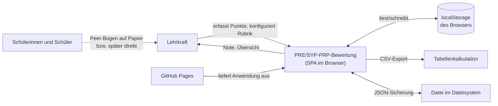
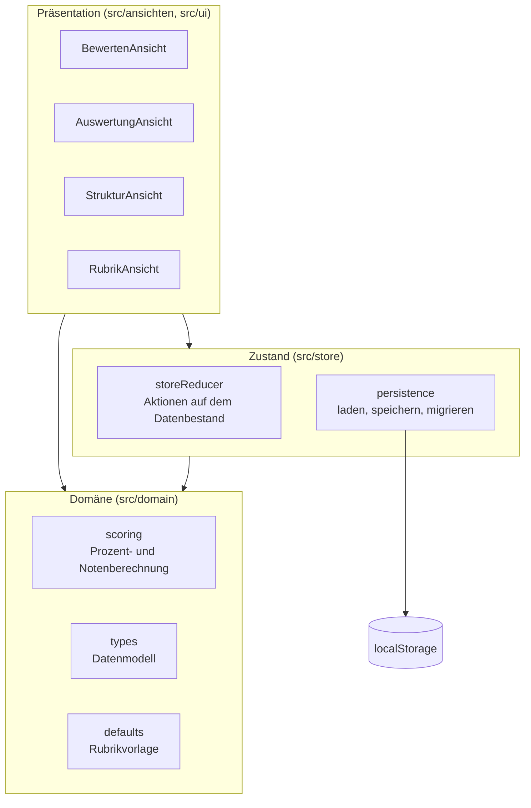
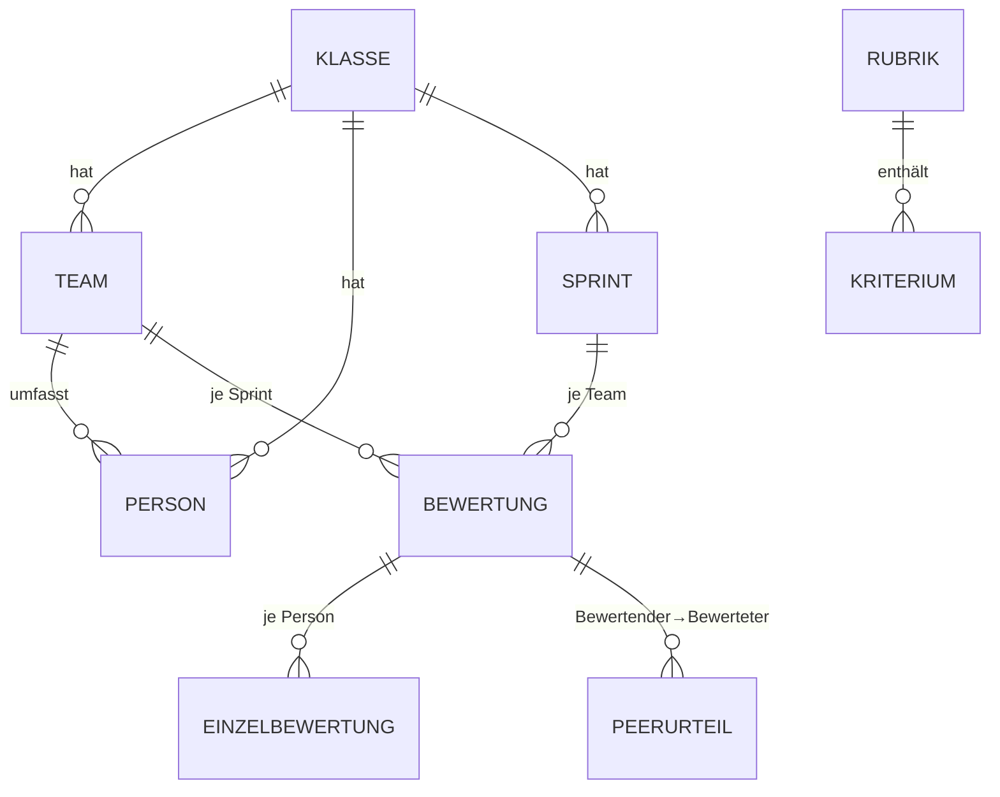
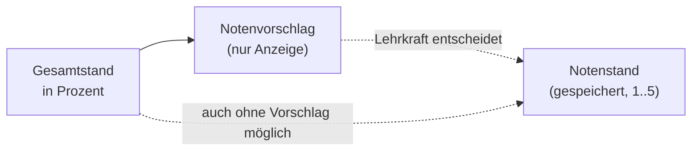
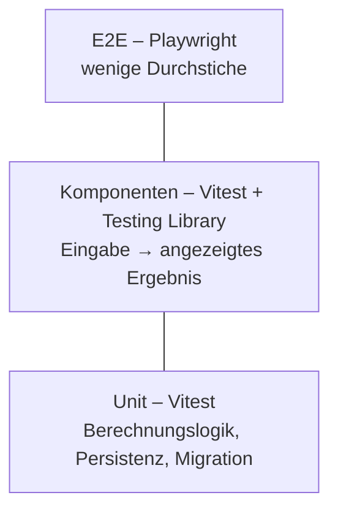
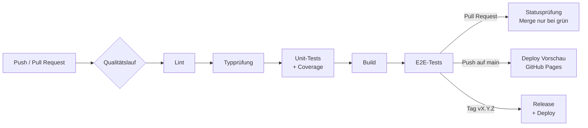

# Solution-Design – PRE/SYP-PRP-Bewertung

| | |
|---|---|
| **Projekt** | PRE/SYP-PRP-Bewertung – Bewertung von Schüler-Softwareprojekten in Sprints |
| **Dokument** | Solution-Design / Technisches Konzept |
| **Version** | 0.15 |
| **Datum** | 2026-09-12 |
| **Autor** | Gerald Hainbucher |
| **Status** | Entwurf – nicht freigegeben |
| **Gültig für Softwarestand** | 0.3.0 |
| **Zuletzt geprüft** | 2026-09-12 |
| **Nächste Prüfung** | Ende Sprint 1 |
| **Bezug** | [Anforderungen](anforderungen.md) v0.22 · [Fachkonzept](fachkonzept-unterricht.md) v0.19 · [Risiken](risiken.md) |
| **Rahmenbedingung** | RB-02 |

---

## 1 Änderungshistorie

| Version | Datum | Autor | Änderung | Status |
|---|---|---|---|---|
| 0.15 | 2026-09-12 | G. Hainbucher | Schemastand 3 (Kap. 5.0a): Planung je Team mit Ziel, Zeitraum und eigener Kriterienkopie; Auflösungsregeln für Kriterien und Zeitraum; Fortschreibung aus dem vorigen Sprint; Migration 2 auf 3 | Entwurf |
| 0.14 | 2026-09-11 | G. Hainbucher | Release 0.3.0: Kap. 6.4a Verstehensnachweis im individuellen Beitrag (FA-40), Kap. 6.6a Tendenz (FA-51); Modulliste um `export/belegfassung.ts` und `export/rueckmeldung.ts` ergänzt; Rechenbeispiel in 6.8 berichtigt | Entwurf |
| 0.13 | 2026-09-11 | G. Hainbucher | Umsetzung nachgezogen: Modulliste um `domain/zuordnung.ts`, `store/sicherung.ts`, `store/ordner.ts` und `export/rubrikblatt.ts` ergänzt; Kap. 5.0 berichtigt (Notenschlüssel im Bestand, `Person.teamId` bleibt als Vorbelegung, `sperreAktiv` erst mit FA-61, `peerEntscheidungen` additiv); Kap. 7.2 zur Berechtigung und zum Schreibtakt berichtigt | Entwurf |
| 0.1 | 2026-09-09 | G. Hainbucher | Ersterstellung: Architektur, Datenmodell, Berechnungslogik, Teststrategie, CI/CD | Entwurf |
| 0.2 | 2026-09-09 | G. Hainbucher | Aktualitätskopf ergänzt; Datenmodell um Auftraggeber, Verstehensnachweis, Reflexion und Auftraggeber-Rückmeldung erweitert (FA-40 bis FA-44); offene Punkte an Risikoanalyse angeschlossen | Entwurf |
| 0.5 | 2026-09-10 | G. Hainbucher | Zeitfaktor nach § 20 Abs. 1 LBVO in Kap. 6.5; Beurteilungszeitraum als eigene Struktur | Entwurf |
| 0.6 | 2026-09-10 | G. Hainbucher | Schemastand 2: Sprint wird zu Abschnitt, Rubrik je Abschnitt (FA-55 bis FA-57); Migration beschrieben; ADR-009 | Entwurf |
| 0.7 | 2026-09-10 | G. Hainbucher | Teamzugehörigkeit je Abschnitt (FA-58); OP-6 dadurch erledigt | Entwurf |
| 0.8 | 2026-09-10 | G. Hainbucher | Stränge Praxis/Theorie mit eigener Rechnung und Sperre (FA-59 bis FA-61); ADR-010 | Entwurf |
| 0.9 | 2026-09-10 | G. Hainbucher | Sicherungskonzept: täglich, datiert, in den schulischen Speicher (Kap. 7.1, DS-06) | Entwurf |
| 0.10 | 2026-09-10 | G. Hainbucher | Automatische Sicherung über die File System Access API (FA-64, ADR-011) | Entwurf |
| 0.11 | 2026-09-10 | G. Hainbucher | Rubrik wird je Abschnitt eingefroren (FA-65); Datenmodell und Kriterienrechnung entsprechend | Entwurf |
| 0.12 | 2026-09-11 | G. Hainbucher | Speicherzeitpunkt berichtigt: zusätzlich sofort beim Verlassen der Seite. Gefunden im ersten E2E-Lauf | Entwurf |
| 0.4 | 2026-09-10 | G. Hainbucher | Peer je Sprint zuschaltbar (FA-52) samt festgehaltener Nachfrage (FA-53) im Datenmodell | Entwurf |
| 0.3 | 2026-09-10 | G. Hainbucher | Bewertungspyramide nachgezogen: gesetzte Werte je Ebene neben den berechneten (FA-50), Notenstand als einzige Ziffer im Bestand (FA-49), Peer als gedeckelter Korrekturfaktor (FA-45), Stichtage (FA-48); ADR-006 und ADR-007 ergänzt | Entwurf |

> **Versionsregel:** wie im Anforderungsdokument. Git-Tag `docs/solution-design-vX.Y`.
> Das Solution-Design verweist stets auf die Version des Anforderungsdokuments, die es umsetzt.

---

## 2 Überblick

Die PRE/SYP-PRP-Bewertung ist eine **rein clientseitige Webanwendung** (Single Page Application). Es gibt
keinen Server, keine Datenbank und keine Anmeldung. Der gesamte Datenbestand liegt im
`localStorage` des Browsers und kann als JSON-Datei gesichert und wieder eingelesen werden.

Diese Entscheidung folgt unmittelbar aus NFA-03 (Daten verlassen das Gerät nicht),
NFA-04 (offline lauffähig), RB-05 (Einbenutzerbetrieb) und RB-06 (keine laufenden Kosten).
Sie ist zugleich die Voraussetzung dafür, dass RB-04 mit GitHub Pages ohne Hosting-Konto
erfüllbar ist.

### 2.1 Technologieentscheidungen

| Bereich | Entscheidung | Begründung |
|---|---|---|
| Sprache | TypeScript | Typsicherheit im Domänenmodell; im Unterricht ohnehin präsent |
| UI-Bibliothek | React 19 | Verbreitet, gut dokumentiert, deklarative Darstellung abgeleiteter Werte |
| Build | Vite 7 | Schneller Build, einfache Konfiguration, erzeugt statische Dateien |
| Unit-Tests | Vitest | Teilt die Vite-Konfiguration, keine zweite Toolchain |
| E2E-Tests | Playwright | Browserübergreifend (NFA-05), prüft auch Offline- und Netzwerkverhalten (NFA-03) |
| Stil | Handgeschriebenes CSS mit Custom Properties | Kein Framework nötig; Kontrast und Themes bleiben kontrollierbar (NFA-08) |
| Auslieferung | GitHub Pages | Statisch, kostenlos, direkt aus der Pipeline (RB-04, RB-06) |
| Persistenz | `localStorage` + JSON-Export | Erfüllt NFA-03/NFA-04 ohne Server |

### 2.2 Bewusst nicht gewählt

| Alternative | Warum nicht |
|---|---|
| Backend mit Datenbank | Widerspricht NFA-03 und RB-06; Betrieb, Datensicherung und Datenschutzfolgenabschätzung wären Aufwand ohne Nutzen für einen Anwender |
| IndexedDB statt `localStorage` | Datenmenge bleibt weit unter 5 MB (A-1: 40 Personen × 12 Sprints); der einfachere Speicher genügt |
| Zustandsbibliothek (Redux, Zustand) | Der Zustand ist ein einziges Dokument mit wenigen Operationen; `useReducer` reicht |
| CSS-Framework | Zusätzliche Abhängigkeit, schlechtere Kontrolle über Kontraste |

---

## 3 Kontextsicht



Es gibt **keine** Verbindung zu einem Anwendungsserver. Die einzige Netzwerkinteraktion
ist das einmalige Laden der Anwendung von GitHub Pages.

---

## 4 Bausteinsicht



**Schichtregel:** `domain` kennt weder React noch den Browser. `store` kennt `domain`.
`ansichten` und `ui` kennen beide. Umgekehrte Abhängigkeiten sind unzulässig – erst dadurch
ist die Berechnungslogik ohne Oberfläche testbar (NFA-06).

| Modul | Verantwortung | Darf nicht |
|---|---|---|
| `domain/types.ts` | Datenstrukturen | – |
| `domain/scoring.ts` | Reine Funktionen für Prozente, Gewichtung, Note, Abschluss eines Abschnitts | Zustand halten, Seiteneffekte |
| `domain/zuordnung.ts` | Welche Rubrik gilt für einen Abschnitt (FA-65), wer war wann in welchem Team (FA-58) | Rechnen, Zustand halten |
| `domain/defaults.ts` | Ausgelieferte Rubriken und Standard-Notenschlüssel | – |
| `store/persistence.ts` | Serialisieren, Laden, Schemamigration, Export/Import | Rechnen |
| `store/storeReducer.ts` | Alle Änderungen am Datenbestand | Rechnen, Darstellung |
| `store/sicherung.ts` | Stand der Sicherung und die Regel, wann erinnert wird (FA-46) | Schreiben, Darstellung |
| `store/ordner.ts` | Zielordner der automatischen Sicherung, File System Access API (FA-64) | Entscheiden, wann gesichert wird |
| `export/csv.ts` | Aufbereitung der Klassenübersicht als CSV | Rechnen (ruft `domain` auf) |
| `export/rubrikblatt.ts` | Kriterienblatt für die Klasse als HTML (FA-39) | Namen oder Punkte kennen |
| `export/belegfassung.ts` | Vollständige Herleitung je Person als HTML (FA-32) | interne Bezeichner ausgeben |
| `export/rueckmeldung.ts` | Rückmeldung an eine Person als HTML (FA-42) | Punkte, Herleitung oder Note zeigen |
| `ui/*` | Wiederverwendete Bausteine, Auswahl-Hilfen, Oberflächenzustand | Rechnen |
| `ansichten/*` | Die vier Bereiche: Darstellung und Eingabe | Rechnen |

---

## 5 Datenmodell



Der gesamte Bestand ist ein einziges JSON-Dokument:

```ts
type Datenbestand = {
  schemaVersion: number;          // 1 bis 0.1.0, ab 0.2.0: 2
  rubrik: Rubrik;                 // Schemastand 1 – wird zu rubriken[0]
  klassen: Klasse[];
  teams: Team[];
  personen: Person[];
  sprints: Sprint[];
  bewertungen: Bewertung[];       // Schlüssel: sprintId + teamId
};

type Bewertung = {
  sprintId: string;
  teamId: string;
  team: Record<KriteriumId, number>;        // Punkte je Kriterium
  prozess: Record<KriteriumId, number>;
  individuell: Record<PersonId, { punkte: Record<KriteriumId, number>; notiz: string }>;
  peer: Record<PersonId /*bewertet von*/, Record<PersonId /*bewertet*/, Record<KriteriumId, 1|2|3|4|5>>>;
  notiz: string;
};
```

**Entwurfsentscheidungen**

- Eine Bewertung je Sprint **und** Team – nicht je Person. Team- und Prozesspunkte gelten
  ohnehin für alle Mitglieder; das vermeidet Redundanz und Inkonsistenz.
- Ein leeres Feld wird **nicht gespeichert** (Schlüssel fehlt). Nur so ist
  „nicht bewertet“ von „0 Punkte“ unterscheidbar (FA-12 Akzeptanzkriterium).
- Kriterien haben stabile IDs. Wird ein Kriterium umbenannt, bleiben erfasste Punkte gültig;
  wird es gelöscht, verschwinden seine Punkte aus der Berechnung, bleiben aber im Bestand,
  bis der Datensatz erneut gespeichert wird.
- **Die maßgebliche Rubrik eines Abschnitts ist `rubrikKopie`, sobald sie existiert** (FA-65).
  Sie entsteht beim ersten Punkteintrag als vollständige Kopie und wird von späteren
  Änderungen an `rubriken[]` nicht berührt. Jede Funktion, die Kriterien oder Gewichte eines
  Abschnitts braucht, liest `rubrikKopie ?? rubrik(rubrikId)` – **nie** die aktuelle Rubrik
  direkt. Eine Verletzung dieser Regel ist von außen nicht zu sehen und fällt erst auf, wenn
  eine Belegfassung im Juni die Kriterien von Juni zeigt.
- Personen sind der Klasse zugeordnet, nicht dem Team. **Ab Schemastand 2 ist die
  Teamzugehörigkeit eine Beziehung je Abschnitt** (`Zugehoerigkeit`, FA-58) und keine
  Eigenschaft der Person mehr. Ein Teamwechsel zwischen zwei Abschnitten – und der Wechsel
  zur Diplomarbeitsgruppe im Mai – verliert dadurch keine Daten: Erfasste Punkte hängen am
  Paar Abschnitt/Team und werden von einem späteren Wechsel nicht berührt.

**Erweiterungen für 0.2.0** (aus Fachkonzept v0.2 und Risikoanalyse v0.1):

```ts
type Team = {
  // …
  auftraggeber?: { name: string; art: 'lehrkraft' | 'kollegium' | 'extern' };  // FA-43
};

type Beurteilungszeitraum = {                 // FA-48, FA-54 AK-3
  id: StichtagId;
  bezeichnung: string;                        // „1. Semester“
  stichtag: string;                           // ISO-Datum
};

type Abschnitt = {                            // FA-56 – ersetzt Sprint ab Schemastand 2
  id: Id;
  klasseId: Id;
  bezeichnung: string;
  art: 'sprint' | 'diplomarbeitsvorbereitung' | 'test';   // FA-56 AK-1, FA-60 AK-1
  strang: 'praxis' | 'theorie';               // FA-59 AK-1
  angekuendigtAm?: string;                    // FA-60 AK-5, nur bei art 'test'
  rubrikId: Id;                               // FA-55 AK-2 – eine Rubrik je Abschnitt
  rubrikKopie?: Rubrik;                       // FA-65 – ab dem ersten Eintrag maßgeblich
  eingefrorenAm?: string;                     // FA-65 AK-5
  von: string;
  bis: string;
  beurteilungszeitraumId: StichtagId;         // bestimmt den Halbierungspunkt
  faktor: number;                             // FA-04, Vorgabe 1, Lernsprint 0,5
  peerAktiv: boolean;                         // FA-52, Vorgabe false
  peerNachfrage?: {                           // FA-53 AK-4
    beantwortetAm: string;
    antwort: 'ja' | 'noch-nicht';
  };
};

type Bewertung = {
  // …
  auftraggeberRueckmeldung?: {                       // FA-44
    einstufung: number;
    text: string;
    herkunft: 'eigene-beobachtung' | 'fremdangabe';  // ergibt sich aus Team.auftraggeber.art
  };
  individuell: Record<PersonId, {
    punkte: Record<KriteriumId, number>;
    notiz: string;
    verstehensnachweis?: { einstufung: number; text: string };  // FA-40
    reflexion?: string;                                          // FA-41
  }>;
};
```

Alle Erweiterungen sind optional; ein Bestand nach Schema 1 bleibt ohne Migration lesbar.
Die Herkunft der Auftraggeber-Rückmeldung wird **mitgespeichert** und nicht bei der Anzeige
aus der Auftraggeberart abgeleitet – sonst ginge sie verloren, wenn der Auftraggeber später
wechselt.

### 5.0 Schemastand 2: Abschnitt statt Sprint (FA-55 bis FA-57)

Mit der zweiten Phase des Gegenstands (Fachkonzept 3.4) trägt nicht mehr der Sprint das
Modell, sondern der **Abschnitt**. Zwei Änderungen am Bestand:

```ts
type Datenbestand = {
  schemaVersion: 2;
  rubriken: Rubrik[];             // FA-55 – statt einer einzigen
  vorgabeRubrikId: Id;            // FA-55 AK-2
  notenschluessel: Notenstufe[];  // gehört zum Gegenstand, nicht zur Rubrik
  abschnitte: Abschnitt[];        // FA-56 – statt sprints
  zugehoerigkeiten: Zugehoerigkeit[];   // FA-58
  strangGewichte: { praxis: number; theorie: number };   // FA-59 AK-3, Vorgabe 75 / 25
  peerEntscheidungen: PeerEntscheidung[];  // FA-53 AK-4
  // klassen, teams, personen, bewertungen unverändert
};

type Zugehoerigkeit = {           // FA-58 – wer war in welchem Abschnitt in welchem Team
  abschnittId: Id;
  personId: Id;
  teamId: Id | null;              // null = in diesem Abschnitt keinem Team zugeordnet (AK-3)
};

type PeerEntscheidung = {         // FA-53 – ab wann fließen Peer-Werte ein
  abschnittId: Id;
  am: string;                     // ISO
  antwort: 'ja' | 'nein' | 'spaeter';
};
```

Drei Festlegungen, die von einer früheren Fassung dieses Kapitels abweichen:

- **Der Notenschlüssel wandert von der Rubrik in den Bestand.** Mit mehreren Rubriken könnten
  sich sonst zwei Schlüssel widersprechen; er gilt aber für den ganzen Gegenstand.
- **`Person.teamId` entfällt nicht**, sondern bleibt als *Vorbelegung* für neu angelegte
  Abschnitte stehen. Maßgeblich ist immer die `Zugehoerigkeit`; fehlt sie für einen Abschnitt,
  gilt die Vorbelegung. Das erspart beim Anlegen eines Sprints die Zuordnung der ganzen Klasse
  von Hand.
- **`sperreAktiv` ist noch nicht im Bestand.** Die Sperre bei negativem Strang (FA-61) steht
  in Release 0.3.0; das Feld kommt mit ihr und wird wie `peerEntscheidungen` additiv ergänzt.

`peerEntscheidungen` ist innerhalb von Schemastand 2 **additiv** hinzugekommen: Ein Bestand
ohne das Feld wird beim Laden um eine leere Liste ergänzt. Ein eigener Schemastand für eine
Liste ohne Bezug zu bestehenden Feldern wäre unverhältnismäßig – er verlangte eine Migration,
die nichts zu migrieren hat.

`Bewertung` behält ihren Schlüssel, nur der Name der Bezugsgröße ändert sich:
`abschnittId + teamId` statt `sprintId + teamId`.

**Migration 1 → 2** (FA-57), fachlich die heikelste Stelle des ganzen Modells, weil hier
Aufzeichnungen eines laufenden Durchgangs auf dem Spiel stehen:

| Schritt | Regel |
|---|---|
| 1 | Der bisherige Bestand wird unverändert unter `pre-syp-prp.data.backup.<Zeitstempel>` gesichert, **bevor** irgendetwas verändert wird (AK-3) |
| 2 | `rubrik` wird zu `rubriken[0]` mit dem Namen „Sprint“; ihre ID wird `vorgabeRubrikId` (AK-1 in FA-55) |
| 3 | Jeder `Sprint` wird zu einem `Abschnitt` mit `art: 'sprint'` und `rubrikId = vorgabeRubrikId`; `sprintfaktor` wird zu `faktor` |
| 4 | In jeder `Bewertung` wird `sprintId` zu `abschnittId`; Punkte, Notizen, Peer-Werte und gesetzte Werte bleiben unberührt |
| 5 | Für jeden Abschnitt und jede Person wird aus der bisherigen festen Teamzuordnung eine `Zugehoerigkeit` erzeugt; `Person.teamId` entfällt (FA-58) |
| 6 | `schemaVersion` wird auf 2 gesetzt – erst als letzter Schritt, damit ein Abbruch dazwischen nicht als erledigt gilt |

Schlägt ein Schritt fehl, wird nichts geschrieben und die Anwendung meldet den Fehler, statt
leer zu starten (AK-5, NFA-09). Ein Bestand nach Schemastand 2 lässt sich **nicht** zurück
auf 1 überführen – eine zweite Rubrik hat dort keinen Platz. Deshalb ist die Sicherung aus
Schritt 1 kein Formalakt.

### 5.0a Schemastand 3: Der Sprint gehört dem Team (FA-66 bis FA-69)

Schemastand 2 nahm an, ein Abschnitt sei ein **gemeinsames Zeitfenster der Klasse**. Diese
Annahme ist am 12.09.2026 gefallen: Dauer und Ziel eines Sprints entstehen je Team beim
Planning, und dabei kommen Kriterien dazu oder fallen weg. Der Abschnitt behält Nummer,
Reihenfolge, Art, Strang und Faktor – alles Zeitliche und Inhaltliche wandert an das Team.

```ts
type Datenbestand = {
  schemaVersion: 3;
  teamabschnitte: Teamabschnitt[];   // FA-66, FA-67 – neu
  // alles Übrige unverändert gegenüber Schemastand 2
};

type Teamabschnitt = {            // die Planung eines Teams für einen Abschnitt
  abschnittId: Id;
  teamId: Id;
  ziel: string;                   // FA-66 AK-1 – was sich das Team vornimmt
  von: string;                    // '' = noch nicht festgelegt
  bis: string;                    // '' = offen; dann keine Stichtagszuordnung (AK-4)
  geplantAm?: string;             // ISO – wann die Planung festgehalten wurde
  rubrikKopie?: Rubrik;           // FA-65 AK-1 – die für dieses Team geltenden Kriterien
  eingefrorenAm?: string;
  angeglichenAm?: string;         // FA-47 AK-6
  herkunft?: Herkunft;            // FA-67 AK-9
};

type Herkunft =
  | { art: 'vorlage'; rubrikId: Id }
  | { art: 'uebernommen'; ausAbschnittId: Id }
  | { art: 'geaendert'; ausAbschnittId: Id | null };
```

**Warum eine eigene Größe und nicht ein paar Felder in `Bewertung`.** Die Planung entsteht am
Sprint**beginn**, also bevor es eine Bewertung gibt. Eine leere Bewertung nur als Träger eines
Datums anzulegen, liefe der Aufräumregel zuwider, die leere Bewertungen entfernt – und beim
nächsten Speichern wäre die Planung weg. Zwei Größen mit verschiedener Lebensdauer gehören
nicht in dieselbe Struktur.

**Zwei Auflösungsregeln**, die ab hier überall gelten und nirgends umgangen werden dürfen:

| Frage | Regel |
|---|---|
| Welche Kriterien gelten? | `teamabschnitt.rubrikKopie` → `abschnitt.rubrikKopie` (Tests und Altbestand) → `rubriken[abschnitt.rubrikId]` → Vorgabe |
| Wann endete der Abschnitt für diese Person? | Test: `abschnitt.bis`. Sonst: `teamabschnitt.bis` des Teams, in dem die Person **in diesem Abschnitt** war (FA-58). Fehlt beides, ist keine Zuordnung möglich |

Die erste Regel steht in `zuordnung.rubrikFuer(daten, abschnitt, teamId)`, die zweite in
`zuordnung.endeFuer(daten, abschnitt, personId)`. Dass sie an genau einer Stelle stehen, ist
kein Stil, sondern Notwendigkeit: Eine Verletzung ist von außen unsichtbar und fällt erst
auf, wenn im Juni eine Belegfassung die falschen Kriterien zeigt oder ein Sprint im falschen
Semester landet.

**Fortschreibung (FA-67 AK-7).** Beim Anlegen einer Planung werden die Kriterien des vorigen
Sprints desselben Teams vorbelegt. „Voriger Sprint“ heißt: derselbe Abschnittstyp außer Test,
dieselbe Klasse, kleinere Nummer, mit vorhandener Planung – davon die größte Nummer. Gibt es
keinen, gilt die Vorlage „Vorbereitungssprint“ (FA-69). Die Rubrik ist damit **Saatgut**: Sie
belegt die erste Planung vor, danach trägt die Kette.

Das hat eine Folge, die in der Oberfläche sichtbar gemacht werden muss: Die Rubrikansicht ist
nicht mehr der Ort, an dem die geltenden Kriterien stehen. Sie zeigt, womit ein Team
**beginnt**, nicht wonach es beurteilt wird.

**Migration 2 → 3** (FA-68):

| Schritt | Regel |
|---|---|
| 1 | Der bisherige Bestand wird unverändert gesichert, **bevor** etwas verändert wird (AK-4) |
| 2 | Für jede Paarung aus Abschnitt und Team, die eine Bewertung oder eine Zugehörigkeit hat, entsteht ein `Teamabschnitt` mit `von`/`bis` des Abschnitts und leerem `ziel` |
| 3 | Trägt der Abschnitt eine `rubrikKopie`, wird sie samt `eingefrorenAm` an jedes Team übernommen; die Kopie am Abschnitt bleibt für Tests und als Rückfalllinie stehen |
| 4 | Tests bekommen keinen `Teamabschnitt`: Sie haben kein Team (FA-60 AK-3) |
| 5 | `schemaVersion` wird auf 3 gesetzt – als letzter Schritt |

Nach der Migration ergibt der Bestand **dieselben Prozentwerte, Notenvorschläge und Sperren
wie vorher** (AK-5). Das ist kein erwarteter Nebeneffekt, sondern die Bedingung: Eine
Umstellung, die Noten verschiebt, wäre eine stille Neubewertung. Der Probebestand aus dem
Testlauf ist der Prüfstein und liegt als Test bei.

### 5.1 Gesetzte Werte und Notenstand (FA-49, FA-50, G8, G9)

Die Bewertungspyramide des Fachkonzepts (Kap. 10.1) ist im Datenmodell **kein zweiter Satz
Felder für dasselbe**. Der berechnete Wert entsteht immer aus den Daten darunter und wird nie
gespeichert; der gesetzte Wert wird gespeichert und **tritt daneben**.

```ts
type GesetzterWert = {
  prozent: number;          // 0..100
  begruendung: string;      // FA-50 AK-5, freiwillig – leer statt fehlend
  gesetztAm: string;        // ISO-Zeitpunkt, für die Belegfassung
};

type Bewertung = {
  // …
  gesetzt?: {
    kategorie?: Partial<Record<KategorieSchluessel, GesetzterWert>>;  // FA-50 AK-1
    abschnittsergebnis?: Record<PersonId, GesetzterWert>;   // hieß hier „sprintergebnis“
  };
};

type Datenbestand = {
  // …
  stichtage: Stichtag[];                                     // FA-48
  gesamtstand: Record<StichtagId, Record<PersonId, GesetzterWert>>;    // FA-50
  notenstaende: Record<StichtagId, Record<PersonId, Notenstand>>;      // FA-49
};

type Notenstand = {
  note: 1 | 2 | 3 | 4 | 5;   // die EINZIGE Stelle im Bestand mit einer Ziffer 1..5
  begruendung?: string;
  gesetztAm: string;
};
```

**Entwurfsentscheidungen**

- **Kein Überschreiben.** Ein gesetzter Wert ersetzt den berechneten nicht (G9, FA-50 AK-2).
  Beide sind jederzeit nebeneinander abrufbar, weil nur der berechnete Wert erklärt, was die
  Person getan hat, und nur der gesetzte, was die Lehrkraft entschieden hat. Technisch fällt
  das leicht: Der berechnete Wert ist eine Funktion des Bestands, keine Spalte darin.
- **Ändern sich später die Daten darunter**, ändert sich der berechnete Wert – der gesetzte
  bleibt unberührt (FA-50 AK-4). Die Oberfläche weist die entstandene Abweichung aus; sie
  entscheidet nichts.
- **Der Notenstand steht außerhalb der Pyramide**, nicht als deren Spitze. Er hängt an
  Person und Stichtag, nicht an einem Sprintergebnis, und kann ohne jeden Prozentwert
  gesetzt werden (FA-49 AK-2). Grund ist G8: Die Note vergibt die Lehrkraft, die Software
  rechnet sie nicht aus.
- **Ohne gewählten Stichtag** greift der feste Schlüssel `gesamter-durchgang`. Ein leerer
  String ließe sich später nicht von „vergessen“ unterscheiden.
- **Kein Feld `note` sonst irgendwo.** Der Notenvorschlag (FA-25) wird bei der Anzeige aus
  dem Prozentwert und dem Notenschlüssel gebildet und **nicht gespeichert** (FA-25 AK-3).
  Wer ihn speichern wollte, hätte eine zweite Wahrheit im Bestand.

---

## 6 Berechnungslogik

Alle Formeln sind in `domain/scoring.ts` implementiert und dort einzeln getestet.

**Grundregel für jede Ebene:** Liegt für eine Ebene ein gesetzter Wert vor, gilt dieser für
alles darüber (FA-50 AK-3). Die Berechnung der Ebene darunter läuft trotzdem weiter – ihr
Ergebnis wird nur nicht weitergereicht. Formal:

$$P_{\text{Ebene}} = \begin{cases} P_{\text{gesetzt}} & \text{wenn gesetzt}\\ P_{\text{berechnet}} & \text{sonst}\end{cases}$$

Jede Funktion in `scoring.ts` gibt daher nicht nur die Zahl zurück, sondern auch ihre
Herkunft – `'berechnet' | 'gesetzt'` – und, falls beides vorliegt, beide Werte. Die Ansichten
entscheiden damit, was sie zeigen (FA-51); sie rechnen nichts nach.

### 6.1 Kategorieergebnis (FA-21)

Für eine Kategorie mit den Kriterien $k$, von denen die Teilmenge $A$ ausgefüllt ist:

$$P_{\text{Kategorie}} = \frac{\sum_{k \in A} \min(\text{punkte}_k,\ \text{max}_k)}{\sum_{k \in A} \text{max}_k} \cdot 100$$

Ist $A$ leer, ist das Kategorieergebnis **undefiniert** (nicht 0).

### 6.2 Peer-Ergebnis (FA-22)

Für die Person $p$, bewertet von den Teammitgliedern $R$ (ohne $p$, sofern die
Selbsteinschätzung nicht zählt), über die Peer-Kriterien $Q$:

$$P_{\text{Peer}}(p) = \frac{1}{|R| \cdot |Q|} \sum_{r \in R} \sum_{q \in Q} \frac{v_{r,p,q} - 1}{4} \cdot 100$$

Fehlende Einzelurteile verringern nur den Nenner; sie zählen nicht als 1.

### 6.3 Peer als gedeckelter Korrekturfaktor (FA-45)

Das Peer-Ergebnis ist **keine gewichtete Kategorie**. Es verschiebt das Sprintergebnis um
höchstens $D$ Prozentpunkte (Vorgabe $D = 5$), mit dem neutralen Punkt bei 50 %:

$$K(p) = \frac{P_{\text{Peer}}(p) - 50}{50} \cdot D \qquad \text{mit } K \in [-D,\ +D]$$

Ist die Peer-Bewertung für den Sprint nicht eingeschaltet (FA-52), liegt kein Peer-Ergebnis
vor oder gibt es überhaupt kein gewichtetes Ergebnis, ist $K = 0$ – eine Person ohne jede
Erfassung bekommt nicht plötzlich Prozentpunkte aus Peer-Werten. Das Ergebnis nach der
Korrektur wird auf $[0, 100]$ geklemmt. `rubrik.gewichte.peer` bleibt ohne Wirkung; das Feld
steht nur noch für die Lesbarkeit älterer Bestände. Eine Klammerung ist rechnerisch nicht nötig, weil
$P_{\text{Peer}} \in [0,100]$ den Faktor bereits begrenzt; sie steht trotzdem im Code, damit
eine spätere Skalenänderung die Deckelung nicht aushebelt.

*Warum so:* Als gewichtete Kategorie hing der Einfluss der Peer-Werte an der Rubrik und war
nach oben offen. Absprachen und Konflikte im Team hätten damit die Note verschieben können
(Risiko R-04, Zielkonflikt ZK-3). Der gedeckelte Faktor macht den maximalen Einfluss zu einer
Zahl, die im Dokument steht.

### 6.4 Sprintergebnis (FA-23)

Mit den Kategoriegewichten $g_c$ und den vorhandenen Kategorieergebnissen $C$ (ohne Peer):

$$P_{\text{Sprint}}(p) = \min\left(100,\ \max\left(0,\ \frac{\sum_{c \in C} g_c \cdot P_c}{\sum_{c \in C} g_c} + K(p)\right)\right)$$

Dadurch ist eine Normierung der Gewichte auf 100 % nicht erforderlich, und fehlende
Kategorien verzerren das Ergebnis nicht nach unten.

### 6.4a Verstehensnachweis im individuellen Beitrag (FA-40)

Der mündliche Verstehensnachweis (Fachkonzept 8.3) ist **keine eigene Kategorie**, sondern ein
Anteil innerhalb des individuellen Beitrags. Mit dem Anteil $v$ (Vorgabe 30 %) und dem
Stufenwert $S \in \{100,\ 66{,}7,\ 33{,}3,\ 0\}$:

$$P_{\text{individuell}} = \frac{(100 - v) \cdot P_{\text{Kriterien}} + v \cdot S}{100}$$

Liegt **kein** Nachweis vor, bleibt $P_{\text{individuell}} = P_{\text{Kriterien}}$ – ein
fehlender Nachweis ist kein misslungener, dieselbe Regel wie bei den Kategorien (ADR-004).
Liegt umgekehrt nur der Nachweis vor, ist $P_{\text{individuell}} = S$: Auch er ist eine
erhobene Leistung und kein Zuschlag auf etwas anderes.

Die Reihenfolge ist festgelegt: **Kriterien → Verstehensnachweis → gesetzter Wert.** Ein
gesetzter Wert (FA-50) steht über beidem; der gerechnete Wert daneben enthält den Nachweis,
damit in der Belegfassung sichtbar bleibt, wovon abgewichen wurde.

### 6.5 Gesamtstand (FA-24)

$$P_{\text{gesamt}}(p) = \frac{\sum_{s} f_s \cdot P_{\text{Sprint},s}(p)}{\sum_{s} f_s}
\qquad\text{über alle Sprints } s \text{ mit vorhandenem Ergebnis}$$

Das Gewicht $f_s$ ist das **Produkt aus Sprintfaktor und Zeitfaktor** (FA-24 AK-3, FA-54):

$$f_s = \underbrace{a_s}_{\text{Sprintfaktor}} \cdot \underbrace{z_s}_{\text{Zeitfaktor}}
\qquad z_s = \begin{cases} 2 & \text{wenn } s > n - \lceil n/2 \rceil \\ 1 & \text{sonst}\end{cases}$$

mit $n$ = Zahl der Sprints **im Beurteilungszeitraum**, nicht im Projekt. Der Sprintfaktor
$a_s$ ist frei einstellbar (Vorgabe 1, Lernsprint 0,5); der Zeitfaktor $z_s$ ergibt sich aus
der Lage und setzt § 20 Abs. 1 LBVO um. Die Aufrundung von $\lceil n/2 \rceil$ geht zugunsten
der späteren Sprints: bei fünf Sprints tragen drei den Faktor 2.

Beide Faktoren werden **getrennt gespeichert und getrennt angezeigt** (FA-54 AK-4). Wer nur
das Produkt sieht, kann nicht mehr unterscheiden, ob ein Sprint schwerer wiegt, weil er
später liegt, oder weil jemand den Faktor verstellt hat.

Ein Sprint ohne Ergebnis fällt aus Zähler und Nenner – dieselbe Regel wie bei den Kategorien
(ADR-004). Zu einem Stichtag (FA-48) läuft die Summe nur über die Sprints des betreffenden
Beurteilungszeitraums; der Zeitfaktor wird dabei **je Zeitraum neu bestimmt**.

Die erwarteten Werte für neun Verläufe stehen in
[Testfälle zur Notenfindung](testfaelle-notenfindung.md) und sind Regressionstests.

### 6.6 Strangstand, Gesamtstand und Sperre (FA-59, FA-61)

Die Rechnung aus 6.5 läuft **je Strang**. Über den beiden Strangständen steht der
Gesamtstand:

$$P_{\text{gesamt}} = \frac{\sum_{j} w_j \cdot P_j}{\sum_{j} w_j}
\qquad j \in \{\text{Praxis},\ \text{Theorie}\},\ w = (75,\ 25)$$

Ein Strang ohne jedes Ergebnis fällt aus Zähler und Nenner – dieselbe Regel wie bei den
Kategorien (ADR-004). Damit ist der Gesamtstand im Oktober, wenn noch kein Test geschrieben
wurde, der reine Praxisstand und nicht ein um 25 % gedrückter Wert.

**Die Sperre** ist keine Rechenoperation, sondern ein Prädikat über den Strangständen:

$$\text{gesperrt} \iff \exists\, j:\ P_j < g_{\text{Genügend}}
\qquad\text{(Vorgabe } g = 51\,\%\text{)}$$

Ist sie erfüllt, lautet der Notenvorschlag „Nicht genügend“, unabhängig von
$P_{\text{gesamt}}$. Ein Strang **ohne Ergebnis** löst sie nicht aus – nur ein vorhandener
Stand unterhalb der Grenze; alles andere würde eine noch nicht erhobene Leistung als
misslungen werten.

`notenvorschlag()` gibt daher nicht nur die Ziffer zurück, sondern auch den Grund:
`{ note, gesperrtDurch: 'praxis' | 'theorie' | null }`. Die Ansichten stellen dar, sie
entscheiden nichts (FA-61 AK-2).

**Kein gespeicherter Wert ändert sich durch die Sperre** (AK-3). Sie ist eine Aussage über
den Bestand, nicht ein Eingriff in ihn – dieselbe Trennung wie zwischen berechnetem und
gesetztem Wert (ADR-006).

### 6.6a Tendenz (FA-51)

Die Standardansicht zeigt statt der Herleitung eine Richtung. Verglichen werden die
**Mediane der beiden Verlaufshälften**, geteilt wie beim Zeitfaktor (zweite Hälfte
aufgerundet); ab $|\Delta| \ge 5$ Prozentpunkten heißt es *steigend* oder *fallend*, darunter
*gleichbleibend*. Weniger als zwei bewertete Abschnitte ergeben keine Richtung.

*Warum der Median und nicht der letzte Wert gegen das Mittel der früheren:* Der zweite Ansatz
lag bei drei der neun Verläufe aus [Testfälle zur Notenfindung](testfaelle-notenfindung.md)
falsch. Ein einzelner Ausfall ließ einen unveränderten Verlauf als Anstieg erscheinen (TF-F)
oder als Absturz (TF-G), und ein schwankender Verlauf ohne Trend als Abstieg (TF-H). Alle neun
sind als Regressionstest hinterlegt.

### 6.7 Notenvorschlag – und was daraus wird (FA-25, FA-49)

Der **Notenvorschlag** ist die kleinste Note, deren untere Prozentgrenze $P_{\text{gesamt}}$
nicht überschreitet. Er ist eine Anzeige, kein Datum: Er wird bei jeder Darstellung neu
gebildet und nirgends abgelegt.

Der **Notenstand** ist das, was die Lehrkraft einträgt (FA-49). Er wird gespeichert. Zwischen
beiden liegt keine Rechnung, sondern eine Entscheidung:



Weicht der eingetragene Notenstand vom Vorschlag ab, bleiben beide sichtbar (FA-49 AK-3).
Der Vorschlag wird dadurch nicht falsch – er ist die Auskunft darüber, was die Daten sagen.

### 6.8 Rechenbeispiel

Rubrik: Team 45 Punkte, Prozess 25 Punkte, Individuell 30 Punkte. Gewichte 45 / 20 / 35.
Peer 4 Kriterien, Deckelung $D = 5$.

| Kategorie | Erfasst | Ergebnis |
|---|---|---|
| Team | 33,5 von 45 | 74,44 % |
| Prozess | 20 von 25 | 80,00 % |
| Individuell | 21 von 30 | 70,00 % |
| *Peer* | *Mittelwert 4,25 von 5* | *81,25 % → Korrektur $K$* |

$$P_{\text{gewichtet}} = \frac{45 \cdot 74{,}44 + 20 \cdot 80 + 35 \cdot 70}{100} = 74{,}0\ \%
\qquad K = \frac{81{,}25 - 50}{50} \cdot 5 = +3{,}1$$

$$P_{\text{Sprint}} = 74{,}0 + 3{,}1 = 77{,}1\ \%$$

Der Notenvorschlag bei Standardschlüssel (1 ab 90, 2 ab 80, 3 ab 65, 4 ab 51) lautet **3**.
Ob der Notenstand 3 wird, entscheidet die Lehrkraft.

Varianten desselben Beispiels gehören zum Regressionstest in `scoring.test.ts`:

| Fall | Ergebnis | Stand |
|---|---|---|
| ohne Peer-Werte | $K = 0$, Sprintergebnis 74,0 % | umgesetzt |
| Peer durchgängig 1 von 5 | $K = -5$, Sprintergebnis 69,0 % – die Deckelung greift | umgesetzt |
| Kategorie „Individuell“ auf 85 % **gesetzt** | berechnet 74,0 % bleibt erhalten, weitergereicht wird $\frac{45 \cdot 74{,}44 + 20 \cdot 80 + 35 \cdot 85}{100} + 3{,}1 = 82{,}4\ \%$ | umgesetzt |

*Berichtigt am 11.09.2026:* Der Bruch ergibt 79,25 %, nicht 79,0 %; mit der Peer-Korrektur
also 82,4 % und nicht 82,1 %. Der Fehler fiel auf, als der Fall zum Test wurde – genau dafür
stehen die Zahlen in diesem Dokument.

---

## 7 Persistenz

| Aspekt | Umsetzung |
|---|---|
| Speicherort | `localStorage`, Schlüssel `pre-syp-prp.data.v1` |
| Zeitpunkt | Bei jeder Änderung, entprellt um 400 ms – **und sofort bei `pagehide` sowie beim Wechsel in den Hintergrund**, sonst geht eine Änderung verloren, die kurz vor dem Schließen erfolgt ist (R-01) |
| Migration | `schemaVersion` im Dokument; `migrate()` hebt ältere Stände an |
| Fehlerfall | Nicht lesbarer Bestand wird nach `pre-syp-prp.data.backup.<Zeitstempel>` kopiert; die Anwendung startet leer mit Hinweis (NFA-09) |
| Sicherung | Vollständiger Export als `pre-syp-prp-<Datum>.json`, Import mit Vorschau und Bestätigung |
| Löschung | Funktion „Alle Daten löschen“ mit zweiter Bestätigung (DS-03) |

### 7.1 Sicherungskonzept

Der Betrieb ist auf **ein Gerät und eine Anwenderin** festgelegt (OP-2, entschieden am
10.09.2026). Damit gibt es keinen Abgleich zwischen Ständen – und genau deshalb hängt alles
an der Sicherung.

| Regel | Warum |
|---|---|
| **Täglich** sichern, in den schulischen Speicher | Ein Verlust kostet höchstens einen Arbeitstag (R-01). Der Ablageort ist der des Schulerhalters, nicht ein privater Dienst (DS-06) |
| Dateiname trägt das Datum: `pre-syp-prp-JJJJ-MM-TT.json` | Eine Sicherung überschreibt keine frühere. Deckt den Fall ab, dass ein beschädigter Bestand gesichert wird, bevor jemand es merkt |
| Die Anwendung erinnert, sobald am laufenden Tag geändert und noch nicht gesichert wurde | FA-46; nach drei Tagen deutlicher |
| Alte Sicherungen werden nicht automatisch gelöscht | Eine Datei fasst wenige hundert Kilobyte; 180 Stände im Jahr sind kein Speicherproblem, aber eine vollständige Historie |

### 7.2 Automatische Sicherung (FA-64)

Die Sicherung soll nicht an einer Gewohnheit hängen. Ein Browser kann jedoch nicht
unbeaufsichtigt an einen festen Ort schreiben – das ist Absicht und keine Lücke. Die **File
System Access API** kommt am nächsten heran:

| Schritt | Umsetzung |
|---|---|
| Ordner wählen | `showDirectoryPicker()`, einmalig durch die Lehrkraft |
| Handle behalten | Der `FileSystemDirectoryHandle` wird in **IndexedDB** abgelegt – nicht in `localStorage`, der nur Zeichenketten kennt |
| Berechtigung | Nach jedem Neuladen ist `requestPermission({ mode: 'readwrite' })` nötig. Die Anwendung fragt beim Start nur `queryPermission` ab und **bittet nie von sich aus**: Der Browser lehnt eine Nachfrage ohne Nutzerhandlung ab. Fehlt die Berechtigung, erscheint der Schalter „Ordner freigeben“ – einmal je Sitzung, nicht bei jeder Änderung |
| Schreiben | Drei Sekunden nach der letzten Änderung – deutlich träger als die 400 ms des Browserspeichers, weil eine Datei je Tastendruck nichts bringt und einen Sync-Ordner belastet. Ziel ist `pre-syp-prp-JJJJ-MM-TT.json` im gewählten Ordner |
| Fehlschlag | Ordner entfernt, Berechtigung entzogen, Schreibfehler: sichtbare Meldung, Rückfall auf FA-46 – **nie stillschweigend** |
| Ohne API | Firefox und Safari kennen sie nicht. Dort wird die Funktion gar nicht angeboten, und die Anwendung sagt warum (NFA-05, ADR-011) |

**Der Zeitstempel der letzten erfolgreichen Sicherung steht dauerhaft in der Oberfläche.** Das
ist kein Komfortmerkmal: Eine automatische Sicherung, die still fehlschlägt, erzeugt
Sicherheit, wo keine ist – und ist damit schlechter als gar keine.

Liegt der gewählte Ordner im schulischen Sync-Ordner, erfüllt sich DS-06 ohne weiteres Zutun.
Die Anwendung selbst baut dabei keine Netzwerkverbindung auf (NFA-03); das Spiegeln in die
Cloud übernimmt der Sync-Client des Betriebssystems, außerhalb der Anwendung.

**Die Anwendung lädt und schreibt dabei nichts über das Netz.** Sie erzeugt eine Datei; wo
diese landet, entscheidet die Lehrkraft. Diese Trennung ist der Grund, warum die tägliche
Cloud-Sicherung NFA-03 nicht verletzt: Keine Netzwerkverbindung der Anwendung, sondern eine
bewusste Handlung der verantwortlichen Person in einen Speicher, für den der Schulerhalter
verantwortlich ist – rechtlich dieselbe Lage wie bei einer dort abgelegten Notenliste.

---

## 8 Teststrategie



| Ebene | Umfang | Anspruch |
|---|---|---|
| **Unit** | `domain/*`, `store/persistence` | ≥ 90 % Zweigabdeckung (NFA-06); enthält Grenzfälle: keine Daten, nur eine Kategorie, Gewicht 0, Punkte über Maximum, fehlende Peer-Urteile, Notenschlüsselgrenzen |
| **Komponenten** | Erfassungsmaske, Auswertung | Eingabe erzeugt erwarteten angezeigten Wert; leere Felder bleiben leer *(ab 0.2.0 – in 0.1.0 durch Unit- und E2E-Tests abgedeckt)* |
| **E2E** | Durchstich: Klasse anlegen → Team → Personen → Sprint → bewerten → Auswertung → CSV | Zusätzlich: kein ausgehender Netzwerkverkehr während der Bedienung (NFA-03), Neuladen erhält Daten |

Ein Fehler, der in Betrieb auffällt, wird zuerst durch einen fehlschlagenden Test
abgebildet und erst dann behoben.

---

## 9 CI/CD-Pipeline (RB-04)



| Auslöser | Läuft | Ergebnis |
|---|---|---|
| Pull Request | Lint, Typprüfung, Unit-, Komponenten- und E2E-Tests | Merge blockiert, solange rot (NFA-07) |
| Push auf `main` | dasselbe + Build | Deployment der Testumgebung auf GitHub Pages |
| Tag `vX.Y.Z` | dasselbe + Build | GitHub Release mit Artefakt und Changelog-Auszug |

Die Testumgebung ist die über GitHub Pages veröffentlichte Version des jeweils aktuellen
`main`-Standes. Sie ist damit für den Auftraggeber jederzeit ohne lokale Installation prüfbar.

---

## 10 Versionierung und Branching (RB-03)

**Semantische Versionierung** `MAJOR.MINOR.PATCH`:

| Erhöhung | Anlass |
|---|---|
| MAJOR | Änderung, die einen bestehenden Datenbestand ohne Migration unbrauchbar macht |
| MINOR | Neue Funktion aus dem Anforderungsdokument |
| PATCH | Fehlerbehebung, Text- oder Darstellungskorrektur |

- `main` ist jederzeit lauffähig und geschützt; direkte Pushes sind unterbunden.
- Arbeit erfolgt in `feature/FA-xx-kurzbeschreibung` bzw. `fix/kurzbeschreibung`.
- Commit-Nachrichten nach *Conventional Commits*, mit Bezug auf die Anforderung:
  `feat(bewertung): Peer-Matrix je Bewertendem erfassen (FA-14)`.
- Ein Release ist ein annotierter Tag `vX.Y.Z` auf `main` samt Eintrag in `docs/CHANGELOG.md`.
- Dokumentversionen werden getrennt getaggt (`docs/anforderungen-v1.0`), damit
  nachvollziehbar bleibt, welcher Softwarestand welche Anforderungsversion umsetzt.

**Zuordnung Anforderung ↔ Umsetzung:** Jede Anforderung erhält bei der Umsetzung ihre
ID im Commit und im Testnamen. Damit ist von der Anforderung zum Test und zum Code
navigierbar – und umgekehrt.

---

## 11 Architekturentscheidungen (ADR)

Kurzform; ausführliche Fassungen unter `docs/adr/`.

| Nr. | Entscheidung | Status |
|---|---|---|
| ADR-001 | Rein clientseitige Anwendung ohne Backend | angenommen |
| ADR-002 | `localStorage` als Speicher, JSON-Datei als Sicherung | angenommen |
| ADR-003 | Bewertung je Sprint und Team als ein Dokument | angenommen |
| ADR-004 | Fehlende Kategorien werden aus der Gewichtung herausgerechnet statt als 0 gewertet | angenommen |
| ADR-005 | Auslieferung über GitHub Pages | angenommen |
| ADR-006 | Gesetzte Werte treten neben die berechneten und ersetzen sie nicht | angenommen |
| ADR-007 | Peer-Werte wirken als gedeckelter Korrekturfaktor statt als gewichtete Kategorie | angenommen |
| ADR-008 | Zeitfaktor als Stufe (zweite Hälfte doppelt) statt als steigende Reihe | angenommen |
| ADR-009 | Der Beurteilungsabschnitt trägt das Modell, nicht der Sprint; eine Rubrik je Abschnitt | angenommen |
| ADR-010 | Die Sperre wirkt auf den Notenvorschlag, nicht auf die gespeicherten Werte | angenommen |
| ADR-011 | Automatische Sicherung über die File System Access API, als Zusatzfunktion für Chromium-Browser | angenommen |

---

## 12 Offene technische Punkte

| Nr. | Punkt | Status |
|---|---|---|
| OP-6 | Teamwechsel zwischen Sprints wird historisiert (Teamzugehörigkeit je Sprint statt global) | **erledigt: FA-58, Bestandteil von Schemastand 2** |
| OP-7 | Wenn FA-20 kommt (Erfassung durch Schülerinnen und Schüler), ist ohne Backend nur ein Kiosk-Modus am Lehrergerät möglich – oder RB-06 muss aufgehoben werden | wartet auf OP-2 |
| OP-8 | Druckansicht für die Belegfassung (FA-32) und für die Rückmeldung an die Person (FA-42) – zwei Ausgaben, zwei Zwecke (Fachkonzept 8.6) | offen |
| OP-9 | Abdeckungsschwelle in der Pipeline erzwingen, sobald genug Tests vorhanden sind | ab 0.2.0 |
